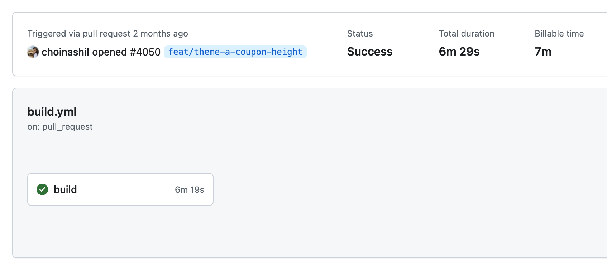
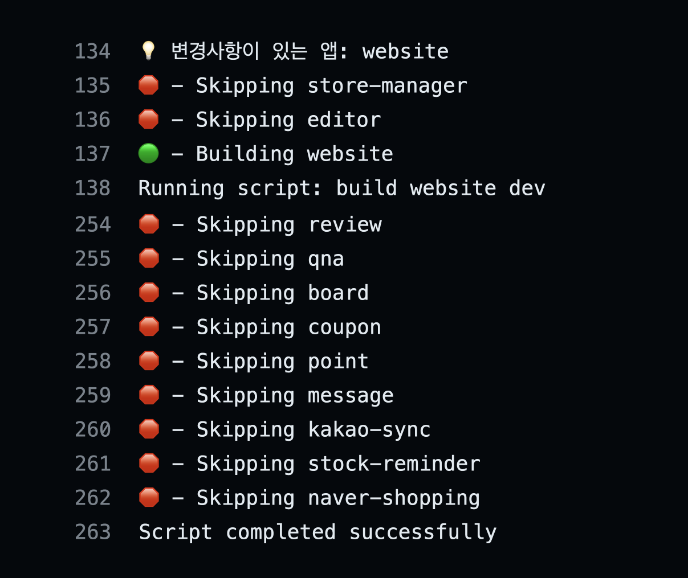
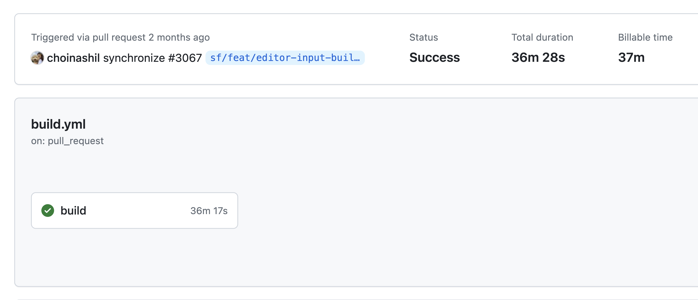
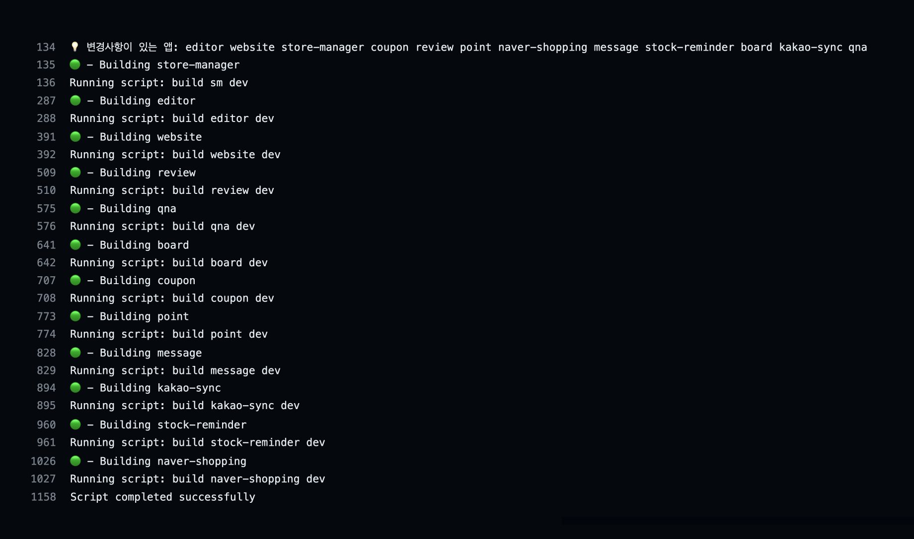
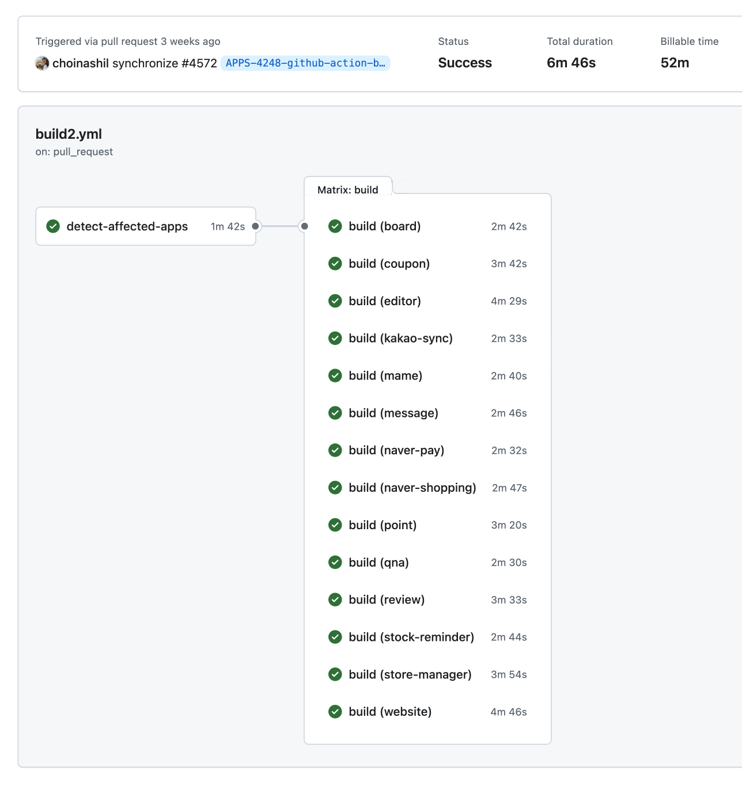
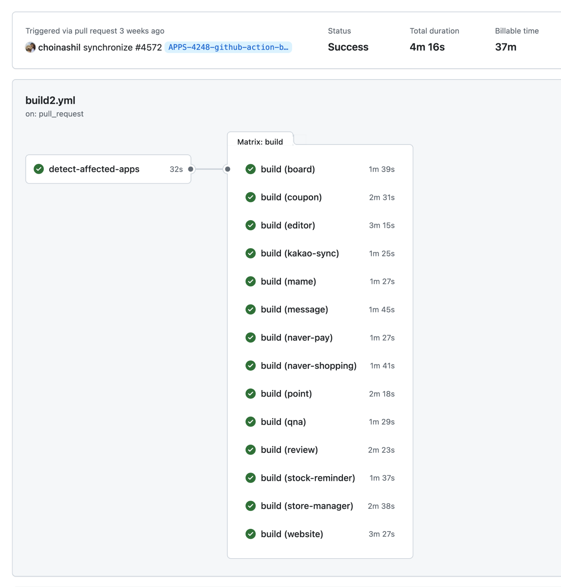
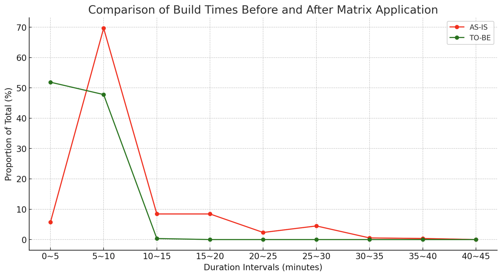

import Figure from "@/components/Figure.astro";

[프론트엔드 앱들을 모노레포로 운영](/posts/sixshop-monorepo)한지도 2년이 흘렀습니다. 앱이 점점 늘어나자 CI 레벨에서 불편한 점들이 발생했습니다. 

현재 사내에서 프론트엔드 앱의 빌드를 위해 사용하는 CI는 아래 두 가지입니다.

1. `Github Actions`: PR을 올릴 때 머지 전 빌드에 문제가 없는지 확인하기 위한 용도
2. `Jenkins`: 통합 테스트 환경이나 운영 환경에 배포하기 위한 용도

이번 글에서는 이 중 1번에 대한 개선 과정을 공유하고자 합니다.

## 개선 전 (AS-IS)

작업자가 PR을 오픈하거나 push를 할 때마다 [nx의 `affected`](https://nx.dev/nx-api/nx/documents/affected) 커맨드를 이용해 이번 PR로 인해 영향을 받는 앱을 판단한 후 해당 앱들만 빌드하도록 CI를 구축해놓았습니다.

기존 yml 파일의 주요 코드는 다음과 같습니다.

```yaml
name: Build Affected Apps

on:
  pull_request:
    types: [opened, synchronize, reopened]
    
jobs:
  build:
    ...
    steps:
    ...
    - name: Build affected apps
      run: |
        # 1
        APPS=("store-manager" "editor" "website" "review" "qna" "board" "coupon" "point" "message"...)

        # 2
        AFFECTED_APPS=$(npx nx affected:apps --plain --base=HEAD^ --head=HEAD) || (echo "Error running nx affected:apps" && exit 1)

        echo "💡 Affected Apps: $AFFECTED_APPS"

        BUILD_ERROR_OCCURRED=false

        # 3
        for APP in "${APPS[@]}"; do
          if echo "$AFFECTED_APPS" | grep -q $APP; then
            echo "🟢 - Building $APP"
            yarn build $APP dev || BUILD_ERROR_OCCURRED=true
          else
            echo "🛑 - Skipping $APP"
          fi
        done

        if [ "$BUILD_ERROR_OCCURRED" = true ]; then
          echo "Script completed with errors"
          exit 1
        else
          echo "Script completed successfully"
        fi

```

1. 프로젝트에 존재하는 앱 목록
2. `nx affected` 커맨드를 사용해 이번 변경사항으로 인해 영향 받은 앱 파악
3. `APPS`를 순회하면서 영향 받은 앱은 빌드하고, 영향 받지 않았다면 스킵

위 과정을 통해 매번 모든 앱을 빌드하는 것이 아니라, 변경사항과 관련된 앱만 빌드하여 비용을 관리하고 있었습니다.

<Figure>

</Figure>

<Figure caption='하나의 앱만 빌드하는 경우(best case): 10분 내외로 종료된다' width='400px'>

</Figure>


하지만 모든 앱에 영향을 주는 공통 라이브러리에 변경사항이 생긴 경우, 전체 앱을 빌드하는 과정에서 for문을 통해 **빌드가 순차적으로 처리되다보니 앱이 많아질수록 빌드 시간이 길어지는 문제점이 발생**했습니다.

<Figure>

</Figure>

<Figure caption='모든 앱을 빌드하는 경우 (worst case): 15분에서 40분까지도 소요된다'>

</Figure>


2024년 3월 1일부터 3월 31일까지 한 달 동안 빌드가 성공적으로 종료된 것은 **557건**이었습니다. 5분 단위로 정리한 통계는 다음과 같습니다.

<Figure width='400px'>
| 소요 시간 | 건수 | 비중 |
| --- | --- | --- |
| 0~5분 | 32건 | 5.75% |
| **5~10분** | **388건** | **69.66%** |
| 10~15분 | 47건 | 8.44% |
| 15~20분 | 47건 | 8.44% |
| 20~25분 | 13건 | 2.33% |
| 25~30분 | 25건 | 4.49% |
| 30~35분 | 3건 | 0.54% |
| 35~40분 | 2건 | 0.36% |
</Figure>

영향 받은 앱만 빌드하다보니 10분 이내로 빌드되는 케이스가 전체의 75% 이상이었습니다. 하지만 반대로 생각하면 10건 중 2~3건 정도는 빌드 시간이 길어져 불편함을 겪었다는 의미이기도 합니다.

프로젝트 초기에는 3개였던 앱이 현재는 14개로 늘어났고 앞으로도 추가될 가능성이 있는 상황에서, 앱이 증가함에 따라 모든 앱을 빌드하는 시간도 선형적으로 증가하는 구조이기 때문에 개선이 필요했습니다.

## 개선 후 (TO-BE)

앱을 순차적으로 빌드하는 것이 가장 큰 문제이다보니 병렬로 처리할 수 있는 방법을 찾아보다가 [matrix](https://docs.github.com/ko/actions/using-jobs/using-a-matrix-for-your-jobs)라는 기능을 알게 됐습니다.
하나의 작업을 다양한 변수 조합(행렬)을 참고해 병렬로 실행시키는 기능입니다.

이를 참고해 수정한 yml 파일을 job별로 설명드리겠습니다.

### 🔍 job1. 영향 받은 앱 파악 (`detect-affected-apps`)

`detect-affected-apps` job에서는 **이번 작업을 통해 영향 받은 앱을 파악하고, 그 결과를 이후 job에서 활용할 수 있도록 전달**한다.

```yaml
jobs:
  # 1
  detect-affected-apps:
    ...
    steps:
      ...
      - name: Determine affected apps
        id: set-matrix
        run: |
          # 2
          AFFECTED_APPS=$(npx nx affected:apps --plain --base=HEAD^ --head=HEAD) || (echo "Error running nx affected:apps" && exit 1)
          
          # 3
          APPS_JSON=$(echo $AFFECTED_APPS | xargs -n 1 | awk '{print "{\"app\": \""$0"\"}"}' | paste -sd, -)
          AFFECTED_APPS_JSON="{\"include\":[$APPS_JSON]}"

          # 4
          echo "affected_apps=$AFFECTED_APPS" >> $GITHUB_OUTPUT
          echo "affected_apps_json=$AFFECTED_APPS_JSON" >> $GITHUB_OUTPUT

          if [ -z "$AFFECTED_APPS" ]; then
            echo "has_affected_apps=false" >> $GITHUB_OUTPUT
          else
            echo "has_affected_apps=true" >> $GITHUB_OUTPUT
          fi
    # 5
    outputs:
      affected_apps_json: ${{ steps.set-matrix.outputs.affected_apps_json }}
      has_affected_apps: ${{ steps.set-matrix.outputs.has_affected_apps }}
```

1. 기존에는 하나의 job 에서 1) 영향 받은 앱 파악과 2) 빌드를 모두 진행했지만, 수정 후에는 각각을 별도의 job 으로 분리할 예정이므로 job 이름을 역할에 맞게 변경
2. `nx affected` 커맨드를 사용해 이번 변경사항으로 인해 영향 받은 앱 파악
    - `AFFECTED_APPS`의 출력 예시:
        
        ```yaml
        store-manager website
        ```
        
3. `AFFECTED_APPS`를 matrix의 변수로 활용할 수 있도록 포매팅
    - `AFFECTED_APPS_JSON` 의 출력 예시:
        
        ```yaml
        {
          "include": [
            {"app": "store-manager"},
            {"app": "editor"},
            {"app": "editor"}
          ]
        }
        ```
        
    

4, 5. 변수를 다른 job 으로 전달

### ⚙️ job2. 빌드 (`build`)

영향 받은 앱을 식별했다면, 결과를 이용해 원하는 후속 처리를 진행하면 됩니다.

기존 CI의 목적이던 빌드를 별도 job으로 분리했습니다.

```yaml
  build:
    # 1
    needs: detect-affected-apps
    ...
    # 2
    if: needs.detect-affected-apps.outputs.has_affected_apps == 'true'
    strategy:
      # 3
      fail-fast: false
      # 4
      matrix: ${{fromJson(needs.detect-affected-apps.outputs.affected_apps_json)}}
    steps:
      - uses: actions/checkout@v4
        with:
          fetch-depth: 0
      - uses: actions/setup-node@v4
        with:
          node-version: 20
      - name: Install dependencies
        run: yarn install
      # 5
      - name: Build affected app
        run: |
          APP=${{ matrix.app }}
          yarn build $APP dev || (echo "Build failed for $APP" && exit 1)
```

1. `detect-affected-apps` job이 완료된 이후 `build` job 실행 ([참고 문서](https://docs.github.com/ko/enterprise-cloud@latest/actions/learn-github-actions/contexts#needs-context))
2. `detect-affected-apps` job에서 전달받은 `has_affected_apps`의 값이 `true`인 경우에만 실행
3. `fail-fast` 전략의 기본값은 `true`이며 병렬 작업 중 하나가 실패할 경우 다른 작업들도 즉시 중단합니다. 여기서는 `false`로 설정하여 일부 앱의 빌드가 실패하더라도 다른 앱들은 영향 받지 않고 빌드되도록 했습니다.
4. `detect-affected-apps` job에서 전달받은 `affected_apps_json` 배열을 matrix의 app 변수로 활용
5. 빌드 스크립트 실행

이를 통해 `build` job이 병렬로 진행되면서 빌드해야 할 앱이 늘어나더라도 최종적으로 걸리는 시간은 다음과 같이 단축됐습니다.

<Figure caption='기존 36분에서 6분대로 약 81% 단축'>

</Figure>


### 🗂️ 스텝 추가: 캐시

시간을 조금 더 줄일 수 있는 방법이 없나 고민하다가 `actions/cache`를 사용하여 **패키지 매니저의 종속성을 캐시**했습니다.

```yaml
- uses: actions/cache@v4
	with:
		# 1
		path: |
			~/.yarn
			**/node_modules
		# 2
		key: ${{ runner.os }}-yarn-${{ hashFiles('**/yarn.lock') }}
		# 3 
		restore-keys: |
			${{ runner.os }}-yarn-
```

1. 캐시할 파일 또는 디렉토리 경로 (프로젝트에 따라 다를 수 있음)
    - `~/.yarn`: yarn의 글로벌 캐시 디렉토리
    - `**/node_modules`: 라이브러리들이 설치된 디렉토리
2. 생성된 캐시의 고유 식별자 설정
    - 실행 중인 작업의 운영 체제를 변수로 사용하여 OS마다 서로 다른 캐시를 사용하도록 함
    - `yarn.lock` 파일에 변경이 생길 때마다 새로운 캐시 키 생성
3. 캐시 키를 찾지 못했을 때 대체할 키 목록 제공
    - OS와 `-yarn-` 문자열을 이용해 일치하는 캐시 검색

`node_modules` 디렉토리를 캐시함으로써 `yarn install` 실행 시 기본적으로는 캐시된 데이터를 활용하고 추가적으로 필요한 부분만 설치하거나 업데이트하여 패키지 설치 시간을 줄일 수 있었습니다.

참고로 위 코드를 추가했다 하더라도 처음에는 캐시가 없어서 바로 속도가 빨라지지는 않고 캐시가 생성된 이후부터 빨라집니다.

캐시를 추가한 이후 종속성 설치 과정이 단축되어 각 job마다 60~70초씩 추가로 단축되는 결과를 얻을 수 있었습니다.

<Figure caption='기존 36분에서 4분대로 약 88%, 캐시 적용 전(6분대)에 비해 37% 단축'>

</Figure>


개선된 코드를 적용한 이후의 데이터도 동일하게 분석해봤습니다.

코드가 적용된 2024년 4월 10일부터 4월 30일까지 20일동안 빌드가 성공적으로 종료된 것은 **295건**이었습니다. 5분 단위로 정리한 통계는 다음과 같습니다.

<Figure width='400px'>
| 소요 시간 | 건수 | 비중 |
| --- | --- | --- |
| **0~5분** | **153건** | **51.86%** |
| **5~10분** | **141건** | **47.80%** |
| 10~15분 | 1건 | 0.34% |
</Figure>

<Figure caption='개선 전후 빌드 시간 통계'>

</Figure>


개선 후에는 0~5분 사이에 완료되는 비중이 절반 정도가 되었고, 거의 모든 상황에서 10분 내 빌드가 마무리되면서 **평균 소요 시간도 9.12분에서 5.21분으로 43% 가량 단축**됐습니다.

### 🔖 (보너스) job3. 영향 받은 앱 목록을 PR 코멘트로 출력 (`comment`)

모노레포 내에서 다양한 라이브러리와 앱들이 서로 연관성을 가지기 때문에 현재의 변경사항이 어떤 앱들에 영향을 주는지 파악이 어려운 경우가 종종 있습니다.

작업자가 의도치 않은 부분에 영향을 미쳤는지를 인지할 수 있도록, `detect-affected-apps` job에서 식별한 영향 받은 앱 목록을 PR 코멘트로 출력했습니다. 

```yaml
  comment:
    # 1
    needs: detect-affected-apps
    runs-on: ubuntu-latest
    steps:
      - name: Comment on PR with affected apps
        # 2
        uses: actions/github-script@v7
        with:
          script: |
            # 3
            const issue_number = context.issue.number;
            const owner = context.repo.owner;
            const repo = context.repo.repo;

            # 4
            const rawAffectedApps = `${{ needs.detect-affected-apps.outputs.affected_apps }}`;
            const affectedApps = rawAffectedApps.split(' ').filter(app => app.trim() !== '');
            const formattedApps = affectedApps.map(app => `\`${app}\``).join(', ');

            const commentIdentifier = '<!-- AFFECTED_APPS_COMMENT -->';
            let commentBody = '';

            if (formattedApps) {
              commentBody = `🙆 이번 작업으로 영향 받는 앱: ${formattedApps}`;
            } else {
              commentBody = '🙅 이번 작업으로 영향 받는 앱이 없습니다.';
            }

            # 5
            const comments = await github.rest.issues.listComments({
              owner,
              repo,
              issue_number,
            });

            # 6
            const existingComment = comments.data.find(comment => comment.body.includes(commentIdentifier));

            # 7
            if (existingComment) {
              await github.rest.issues.updateComment({
                owner,
                repo,
                comment_id: existingComment.id,
                body: `${commentIdentifier}\n${commentBody}`,
              });
            } else {
              await github.rest.issues.createComment({
                owner,
                repo,
                issue_number,
                body: `${commentIdentifier}\n${commentBody}`,
              });
            }

```

1. `detect-affected-apps` job이 완료된 이후 `comment` job 실행
2. 워크플로우 내에서 자바스크립트 코드를 실행할 수 있게 해주는 액션
3. `actions/github-script`가 제공해주는 `context`를 통해 워크플로우 컨텍스트와 관련된 데이터 참조
4. `detect-affected-apps` job에서 전달받은 `affected_apps` 값을 포맷하여 코멘트 생성
5. PR의 모든 코멘트 가져오기
6. `commentIdentifier`가 포함된 코멘트 검색
7. 코멘트가 이미 존재한다면 기존 코멘트 업데이트, 존재하지 않는다면 새 코멘트 생성

PR이 생성된 뒤에도 코드가 수정되어 푸시될 때마다 영향받은 앱이 다시 판단되어 코멘트가 수정됩니다.

프로젝트에서는 워크플로우 실행 시점을 1) PR이 오픈됐을 때(opened), 2) PR이 열린 상태에서 push 됐을 때(synchronize), 3) 닫혔던 PR이 다시 오픈했을 때(reopened) 3가지로 설정했기 때문에 코멘트를 추가할 PR이 항상 존재한다는 것을 전제로 합니다.

```yaml
on:
  pull_request:
    types: [opened, synchronize, reopened]
```

만약 PR이 존재하지 않는 상황에서도 워크플로우가 실행되어야 한다면 comment job에 추가적인 조건을 작성해야 에러가 나지 않을 것입니다.

이 기능을 추가한 뒤, 다른 앱에 영향을 미치지 않을 것이라 생각했던 A앱의 작업이 의도치 않게 B, C, D앱에도 영향을 미치고 있음을 알게 되어 팀 차원에서 종속성을 분리하는 구조 개선 작업을 진행하기도 했습니다.

## 마치며

모노레포로 프론트엔드 앱을 운영하면서 앱이 늘어나니 CI 레벨에서 불편함이 발생했습니다.

GitHub Actions의 matrix 기능을 사용하여 여러 앱을 순차적으로 빌드하던 기존 코드를 병렬로 실행되게 개선했고, PR 머지 전 오래 기다려야 했던 불편함을 줄일 수 있었습니다. 
모든 앱이 빌드되어야 하는 상황에서도 최대 10분 정도만 기다리면 되다보니 체감하는 속도가 이전보다 확실히 빨라졌습니다. 

이 외에도 종속성을 캐시하여 패키지 설치 시간을 줄이고, 영향 받은 앱 목록을 PR 코멘트로 출력하여 작업자가 의도치 않은 부분에 영향을 미쳤는지를 인지할 수 있도록 했습니다.

전체 코드는 [여기](https://gist.github.com/choinashil/9081bf4abb7d8b78f8443fd4a9e801ab)서 참고해주세요!