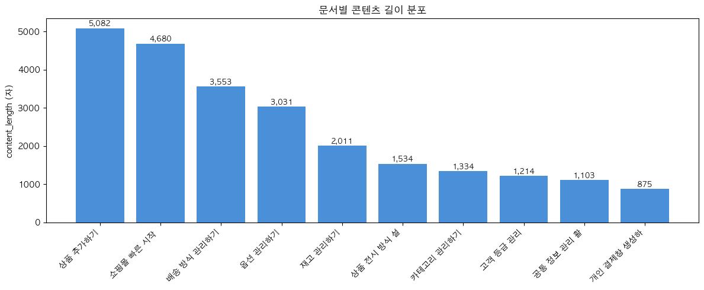
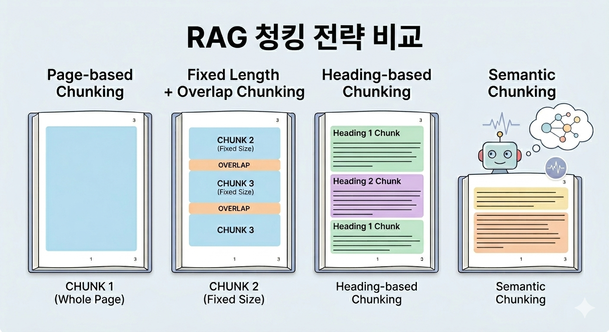
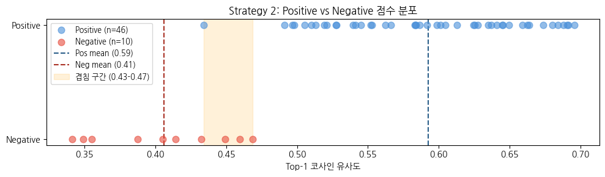
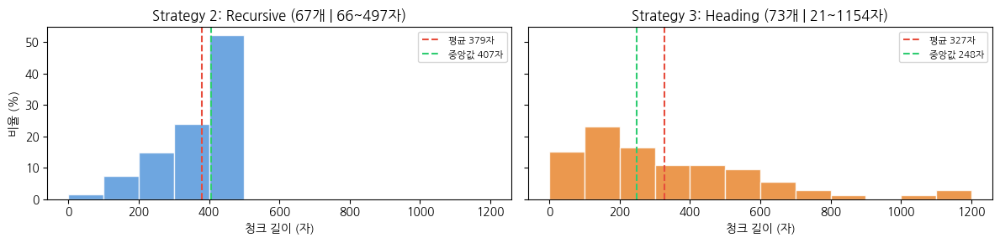
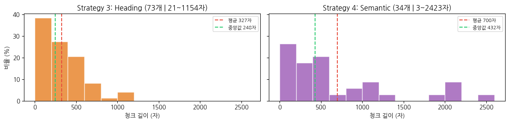
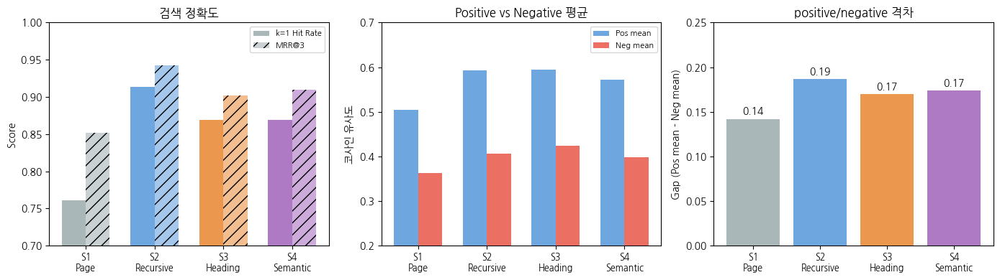

import Callout from "@/components/Callout.astro";
import Figure from "@/components/Figure.astro";

## 들어가며

SixPro AI Assistant 프로젝트를 진행하면서 RAG 청킹 전략을 비교하는 테스트를 수행했습니다.

이 프로젝트는 [식스샵 프로](https://www.sixshop.com/) 기반의 **이커머스 어드민 AI 어시스턴트**로, 회사 PoC에서 시작하여 개인적으로 완성시킨 프로젝트입니다.

[**Demo**](https://sixpro-ai-assistant.vercel.app/) | [**Blog**](/posts/sixpro-ai-assistant) | [**GitHub**](https://github.com/choinashil/sixpro-ai-assistant)

PoC를 진행하던 당시, RAG 개념을 처음 접하고 구현하다 보니 [식스샵 프로 가이드](https://help.pro.sixshop.com/) 문서를 크롤링 후 어떤 단위로 임베딩해야 할지 감이 안왔습니다.
페이지 내용을 그대로 임베딩해 보기도 하고, 좀 더 작게 쪼개는 게 좋겠다는 생각이 들어 마크다운 헤딩 기반으로 잘라보려고도 시도했습니다.<br/>
하지만 구현이 쉽지 않았고 어떤 방식이 정답인지도 알기 어려워서, 결국 페이지 통째로 임베딩하는 방식을 선택했었습니다.
문서 규모가 작아 잘 동작하는 것처럼 보였지만, 방대한 양이 들어갔을 때 검색 정확도를 어떻게 검증할지가 막막했습니다.

이후 [LLM 강의](https://learningspoons.com/course/detail/ai-agent-master/)를 수강하면서, 평가셋을 구축하여 청킹 전략별 정답률을 비교하는 RAG의 성능 평가 개념을 접하게 됐습니다.

이번 프로젝트에서 직접 테스트를 진행하여 얻은 객관적인 수치를 기반으로 청킹 전략을 선택하고 적용했습니다.


## 실험 설계

### 데이터

테스트는 **10개 페이지를 대상으로 진행**했습니다.<br />
프로젝트에서는 최종적으로 231개의 페이지를 크롤링하여 적용했지만, 테스트 당시에는 크롤링 로직이 완성되기 전이었고 테스트 자체가 처음이다보니 작은 단위로 경험하는 것이 좋겠다고 생각했습니다.

10개 문서의 길이는 **최소 875자에서 최대 5,082자까지 편차가 큰 편**이었고, 평균값은 2,442자였습니다.

<Figure>

</Figure>

### 청킹 전략

아래 4가지 청킹 전략을 비교했습니다.

1. 페이지 단위
2. 고정 길이 + 오버랩
3. 헤딩 기반
4. 의미 기반

<Figure caption='Gemini로 생성한 이미지입니다'>

</Figure>

첫 번째는 **페이지 전체를 하나의 청크로 사용**하는 가장 단순한 방식입니다.

두 번째는 **고정 길이 + 오버랩 방식**입니다. <br/>
LangChain의 `RecursiveCharacterTextSplitter`를 사용하여 **청크 크기 500자, 오버랩 100자로 설정**했습니다.
고정 길이로 자르면 문장이 중간에 끊길 수 있으므로, 오버랩을 두어 앞뒤로 맥락을 보존합니다. <br/>
여기까지는 의미가 아닌 단순 글자 수를 기준으로 분할하는 방식입니다.

세 번째는 **헤딩 기반 방식**입니다.<br/>
PoC 때 떠올린 아이디어로, 작성자가 주제별로 분류해둔 단락을 그대로 활용하면 의미가 일관된 청크가 만들어져 임베딩 품질이 좋을 것으로 기대했습니다.<br/>
LangChain의 `MarkdownHeaderTextSplitter`를 사용해 **h3, h4 단위로 내용을 구분**하도록 했습니다.

네 번째는 **의미 기반 방식**입니다. <br/>
헤딩 기반이 작성자가 구분해둔 구조를 따르는 방식이라면,
의미 기반은 **LLM이 문서를 읽고 의미적 변곡점이 생기는 지점을 감지하여 분할**하는 방식입니다.

LangChain에서 실험적으로 제공하는 `SemanticChunker`는 문장을 순서대로 임베딩한 뒤, 인접 문장 간 유사도가 급격히 떨어지는 지점에서 분할합니다.
임베딩 모델이 의미를 분석하므로 헤딩이 없는 문서에도 적용 가능하며, 임베딩 API 비용이 발생합니다.<br />
`SemanticChunker` 사용 시 percentile 임계값으로 청크를 나누는 기준을 조절할 수 있습니다.<br />
이 값을 낮추면 문서가 더 잘게 나뉘고 높이면 더 크게 나뉘는데, 이번 테스트에서는 **기본값인 95th를 사용**했습니다.

저는 **의미 단위로 분할하는 세 번째, 네 번째 전략이 단순 분할보다 뛰어난 결과를 낼 것이라 예상**했고, 
의미 기반 방식 둘 중 어느 쪽의 점수가 높을지 궁금했습니다.

### 평가 방법

청킹 전략을 비교하려면 정답이 정해진 질문-답변 쌍, 즉 평가셋이 필요합니다.
실제 사용자가 할 법한 질문을 만들어야 하는데, 문서가 방대하거나 개발자가 잘 모르는 도메인을 다뤄야 하는 경우 직접 작성하는 것이 쉽지 않기 때문에
강의에서 배운 대로 LLM을 사용하여 질문을 생성했습니다.

평가셋에는 문서에 정답이 있는 positive 문항과 정답이 없는 negative 문항이 모두 필요합니다.
각 페이지마다 난이도별로 positive 문항을 생성했습니다.

| 난이도 | 개수 | 설명 |
| --- | --- | --- |
| **easy** | 1~2개 | 원문 텍스트를 거의 그대로 사용하여 질문 |
| **medium** | 1~2개 | 내용을 다른 표현으로 바꾸어 질문 |
| **hard** | 1개 | 여러 부분을 조합해야 답할 수 있는 질문 |

positive 문항에는 근거 문장(evidence)를 함께 포함하도록 하여, 질문이 올바르게 도출되었는지 사람이 검증할 수 있게 했습니다.
negative 문항은 문서에 답이 없어야 하므로, 실제 존재하는 주제를 모두 알려주고 이에 해당하지 않는 질문을 생성하도록 했습니다.<br />
positive 문항은 페이지당 3~5개씩 총 46개, negative 문항은 positive의 약 20%인 10개를 생성하여 **총 56개의 평가셋을 구축**했습니다.

말투도 검색 성능에 영향을 주기 때문에 존댓말·반말·명사형 종결 어미 등 다양한 말투를 사용하도록 했습니다.

**positive 문항 예시**
```
{
  "question": "도메인 연결 후 적용되기까지 시간이 얼마나 걸리나요?",
  "relevant_doc_urls": ["https://help.pro.sixshop.com/shoppingmall-start"],
  "difficulty": "easy",
  "evidence": "이 네임서버를 도메인 구매처에 입력하면 약 24시간 이내 연결됩니다."
}
```

**negative 문항 예시**
```
{
  "question": "상품 리뷰에 악성 댓글이 달렸는데 삭제하거나 숨길 수 있어?",
  "relevant_doc_urls": [],
  "difficulty": "negative"
}
```

평가 메트릭으로 **Hit Rate(k=1, 3, 5), MRR, Average Precision**을 사용했습니다.
이 중 전략 간 차이가 가장 뚜렷했던 Hit Rate를 중심으로 분석합니다.

이와 함께 **positive 질문과 negative 질문의 유사도 점수 분포**를 비교했습니다.
두 분포 간 격차가 클수록 정답이 있는 결과와 정답이 없는 결과를 점수로 구분할 수 있어 임계값을 설정하기 쉬워집니다.<br />
또한 **오답 사례를 분석**을 통해 각 전략에서 검색이 실패하는 원인도 분석했습니다.

임베딩 모델은 `text-embedding-3-small`(1536차원)을 사용했습니다.

## 결과

결과는 예상 밖이었습니다.<br />
의미 기반 청킹의 결과가 우세할 것이라 생각했지만, 두 번째 전략인 **고정 길이 방식이 가장 높은 점수를 기록**했습니다.

### 전략 1: 페이지 단위 (baseline)

예상대로 결과가 가장 좋지 않았습니다.<br />
특히 **k=1 Hit Rate가 0.76**으로 4가지 전략 중 가장 낮았습니다.

또, **정답임에도 유사도 점수가 0.26으로 매우 낮게 나온 경우**가 있었습니다.<br />
'쇼핑몰 빠른 시작 가이드'(4,680자)는 12가지 소주제를 포함하고 그 중 도메인 관련 내용은 한 문단뿐인데,
임베딩 벡터가 문서 전체로 분산되어 해당 내용의 특징이 약해진 것으로 파악됩니다.<br />
이처럼 특정 내용이 긴 문서에 짧게 언급된 경우, 정답을 못 찾거나 찾아도 점수가 낮게 나왔습니다.

<Callout emoji='🔍'>
**정답이지만 점수가 낮은 경우**
- 질문: 도메인 연결 후 적용되기까지 시간이 얼마나 걸리나요?
- **결과: O**
- **유사도: 0.259**
- **기대 문서: 쇼핑몰 빠른 시작 가이드**
- 실제 결과: 쇼핑몰 빠른 시작 가이드

<br />
**긴 문서 내에서 정답을 찾지 못한 경우**
- 질문: PG 신청하면 결제 오픈까지 얼마나 걸려?
- **결과: X** 
- 유사도: 0.367
- **기대 문서: 쇼핑몰 빠른 시작 가이드**
- 실제 결과: 개인 결제창 생성하기
</Callout>

문서 길이가 긴 페이지들은 이후 전략들에서 작은 단위로 분할하면서 결과가 개선되었습니다.

### 전략 2: 고정 길이 + 오버랩

전반적인 점수가 가장 좋게 나왔습니다.

페이지 단위 대비 **k=1 Hit Rate가 0.76에서 0.91로 상승**했습니다.<br />
46개 질문 중 약 42개가 1위에서 바로 정답을 찾았다는 의미입니다.
**k=5로 확장하면 Hit Rate가 1.0**으로 모든 질문에서 정답을 찾을 수 있었습니다.

전략 1에서 정답이지만 점수가 낮았던 **'도메인 연결' 질문의 유사도가 0.259에서 0.43으로 대폭 개선**됐는데,
긴 문서에서 도메인 관련 문단이 별도 청크로 분리되면서 임베딩이 해당 내용을 더 잘 반영하게 되었기 때문인 것으로 보입니다.

<Figure caption='전략 2의 positive, negative 점수 분포 그래프'>

</Figure>

**positive/negative 점수 간 격차도 0.14 → 0.19로 증가**하여 정답과 오답의 경계가 뚜렷해졌습니다.

다만 **k=1 Hit Rate가 0.913으로 4건의 오답이 존재**합니다.<br />
유사도 낮은 하위 10개 질문은 모두 정답인 반면, **오답 4건은 오히려 유사도가 높게** 나와서 점수만으로 정답과 오답을 판별하기 어려운 케이스입니다.

### 전략 3: 헤딩 기반

기대했던 헤딩 기반 방식은 전략 2에 비해 **전반적으로 점수가 하락**했습니다.

<Figure caption='전략 2와 전략 3의 청킹 길이 분포 비교'>

</Figure>

73개 청크 중 **200자 미만 청크가 28개(약 38%)로 짧은 청크가 많아**졌습니다.<br />
짧은 청크는 문맥이 부족하여 의미가 불분명해지고 질문과 정확히 매칭되기 어렵습니다.
고정 길이 기반은 500자 단위로 균일하게 청크 길이가 유지되고 오버랩으로 경계 정보가 보존되지만,
헤딩 기반은 오버랩이 없어 문맥이 끊기는 경우가 발생합니다.

**문서별 청크 수 편차**도 큽니다.<br />
'상품 추가하기'는 h4가 많아 하나의 페이지가 23개 청크로 나뉜 반면, '개인 결제창 생성하기'는 헤딩이 거의 없어 1개 청크가 그대로 저장되었습니다.
청크가 많은 문서는 검색에서 매칭될 확률이 높아집니다.
실제로 오답 4건 중 3건에서 '상품 추가하기'가 결과로 반환되었습니다.

<Callout emoji='🔍'>
**'상품 추가하기'를 반환한 오답들**
- 질문: 개인 결제창 상품 카테고리를 왜 미분류로 해야 하나요?
- **결과: X**
- 유사도: 0.484
- 기대 문서: 개인 결제창 생성하기
- **실제 결과: 상품 추가하기**
<br />
- 질문: 특정 고객한테만 따로 결제 링크 보내고 싶은데 어떻게 해?
- **결과: X**
- 유사도: 0.503
- 기대 문서: 개인 결제창 생성하기
- **실제 결과: 상품 추가하기**
<br />
- 질문: 등급 이름 최대 몇 자까지 설정 가능해?
- **결과: X**
- 유사도: 0.513
- 기대 문서: 고객 등급 관리
- **실제 결과: 상품 추가하기**
</Callout>

**positive/negative 격차도 전략 2의 0.19에 비해 0.17로 오히려 줄어**들었습니다.<br />
positive 평균은 전략 2와 동일하지만, 짧은 청크가 키워드에 민감하게 반응하면서 **negative 최댓값이 0.47에서 0.53으로 상승**한 것이 원인으로 보입니다.

사람이 읽기에 논리적인 구조가 임베딩 검색의 품질로 이어지지는 않는 것 같습니다.


### 전략 4: 의미 기반

의미 기반도 헤딩 기반과 큰 차이는 없었습니다.<br />
**k=1 Hit Rate는 0.870, positive/negative 격차가 0.17**로 두 지표 모두 전략 3과 동일했습니다.

<Figure caption='전략 3과 전략 4의 청킹 길이 분포 비교'>

</Figure>

**평균 청크 길이가 700자**로 전략 3(327자)의 두 배 이상이며, 청크 수는 34개입니다.
다만 최소 3자에서 최대 2,423까지 **길이 편차는 오히려 늘었**습니다.

전략 3에서 문제였던 짧은 청크의 키워드 과민 반응은 줄어들어 **오답이 4건에서 1건으로 감소**했습니다.

의미 기반 분할은 문맥을 고려한 분할이지만, 청크 길이를 제어할 수 없다는 한계가 있었습니다.


### 종합 비교

| 전략 | 청크 수 | k=1 Hit Rate | k=5 Hit Rate | p/n 격차 |
| --- | --- | --- | --- | --- |
| 1. 페이지 단위 | 10개 | 0.761 | 0.978 | 0.14 |
| **2. 고정 길이** | 67개 | **0.913** | **1.000** | **0.19** |
| 3. 헤딩 기반 | 73개 | 0.870 | 0.957 | 0.17 |
| 4. 의미 기반 | 34개 | 0.870 | 0.978 | 0.17 |

<Figure>

</Figure>

**전략 2(고정 길이 + 오버랩)가 모든 지표에서 가장 높은 점수를 기록**했습니다.<br />
**k=1 Hit Rate은 0.913으로 가장 높고, k=5에서는 1.0으로 5개 결과 안에 정답이 항상 포함**되었습니다.
positive/negative의 격차도 가장 명확하게 벌어져 있어서, 두 분포의 겹침 구간(Positive min 0.43 ~ Negative max 0.47)을 기준으로 **0.45~0.50 사이에서 임계값을 설정**할 수 있었습니다.

각 전략을 정리해보면 다음과 같습니다.
1. 페이지 단위 방식은 긴 문서에서 임베딩 의미가 약해져 검색 정확도가 낮아질 수 있습니다.
2. 고정 길이 방식은 단순한 방식임에도 균일한 길이와 오버랩을 바탕으로 효과적인 결과를 냈습니다.
3. 헤딩 기반 방식은 논리적 구조가 검색에 최적인 분할로 이어지지 않았으며, 문서별 청크 수 편차가 크고 헤딩 구조에 따라 결과가 달라질 수 있습니다.
4. 의미 기반 방식은 길이 제어가 어렵고 청크 길이의 편차가 가장 컸습니다.

**프로젝트에는 `RecursiveCharacterTextSplitter(chunk_size=500, chunk_overlap=100)`를 적용**했습니다.


## 마치며

이번 실험을 통해 의미 기반으로 쪼개면 성능이 좋을 거싱라는 가설이 실제 수치와는 다를 수 있다는 점을 알게 되었습니다.

임베딩이 문맥의 의미를 벡터화하는 과정이기는 하지만, 일관된 청크 길이 확보와 오버랩을 통한 전후 맥락 보존이 검색 품질에 더 큰 영향을 미쳤습니다.
**때로는 복잡한 방법보다 단순하고 명확한 규칙이 더 강력하다**는 점을 체감할 수 있었습니다.

**정성적인 감보다 정량적인 지표에 근거하여 의사결정**을 내릴 수 있게 된 점도 큰 수확입니다.
PoC 단계에서는 임의로 임계값을 설정했기 때문에 테스트마다 일관된 응답을 얻을 수 없어 값을 신뢰하기 어려웠습니다.
하지만 이번 실험에서는 positive와 negative 질문의 유사도 점수 분포를 시각화하여 데이터에 근거한 임계값을 도출할 수 있었습니다.

물론 실험 결과와 실제 서비스 사이에는 여전히 간극이 존재합니다.
SixPro AI Assistant 프로젝트에서 [RAG 검색을 Function Calling의 툴 중 하나로 정의했더니,
LLM이 임의로 검색을 건너뛰어서 검색 성능과 별개로 검색 결과 자체가 활용되지 못 하는 예상치 못한 상황이 발생](/posts/sixpro-ai-assistant#청킹-전략-비교-실험)하기도 했습니다.
철저한 청킹 전략만큼이나 전체 에이전트 워크플로우 내에서 RAG가 적절히 실행되도록 보강하는 설계도 중요하다는 것을 배웠습니다.

이번 실험은 작은 범위로 진행했으므로, 실제 프로젝트에 사용된 231개의 문서 전체를 대상으로 이 전략이 유효한지 다시 한 번 테스트를 해보는 것도 의미가 있을 것 같습니다.
또한 이번에 가장 좋은 점수를 기록한 고정 길이 방식 안에서도 청크 크기와 오버랩 수치를 조정하여 최적값을 찾아보는 것도 흥미로울 것 같습니다.

상세한 테스트 과정과 코드, 수치 데이터를 [Colab](https://colab.research.google.com/drive/1Rf7gqvS8RFI2lpSYVYmSdnaNQu3o9i2Y#scrollTo=WQMYkHn-JjTG)에 정리해 두었으니 관심 있는 분들은 참고 부탁드립니다.
