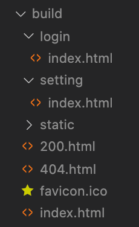
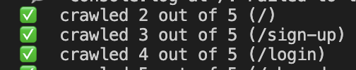
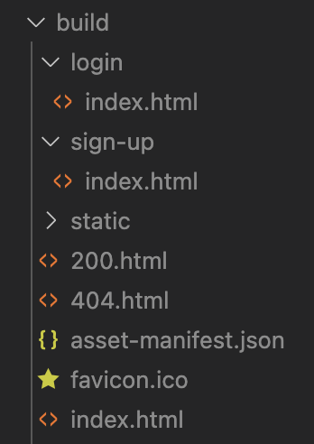
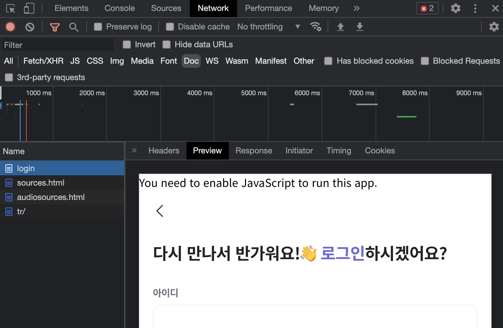
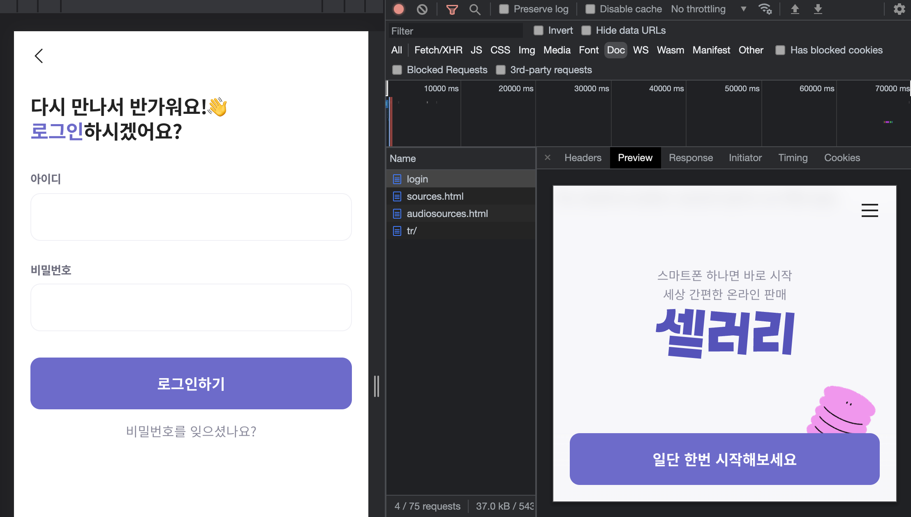
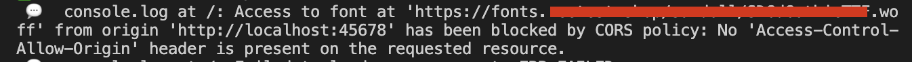
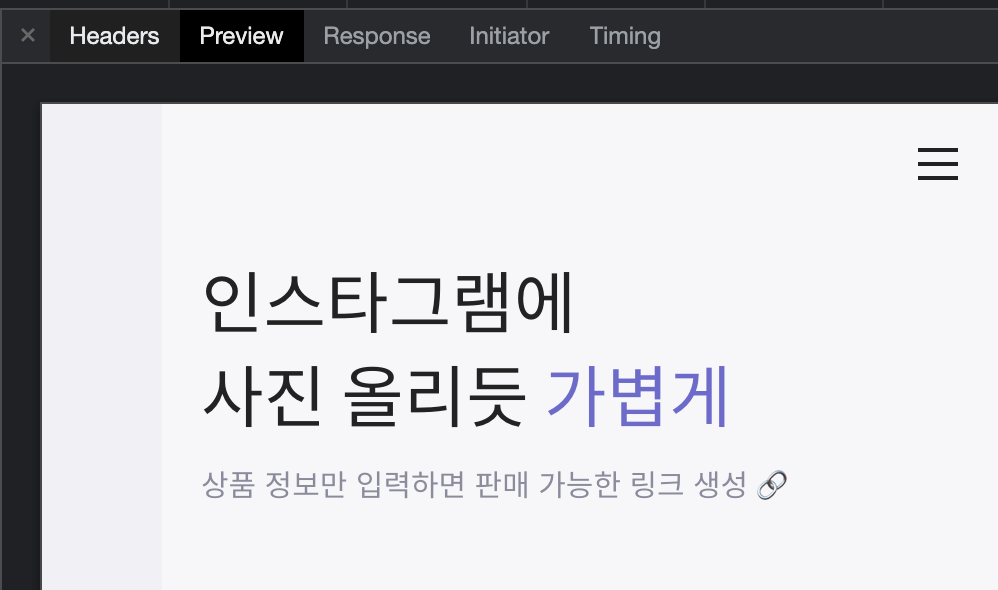
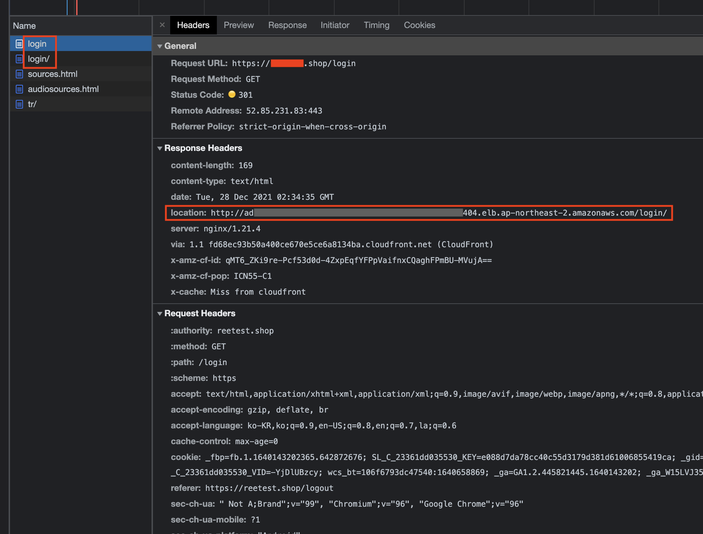
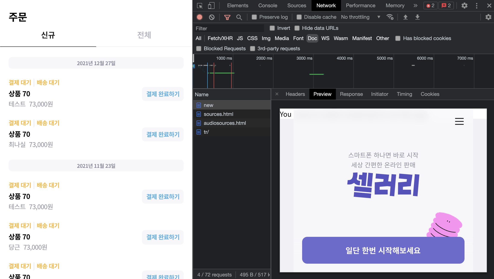
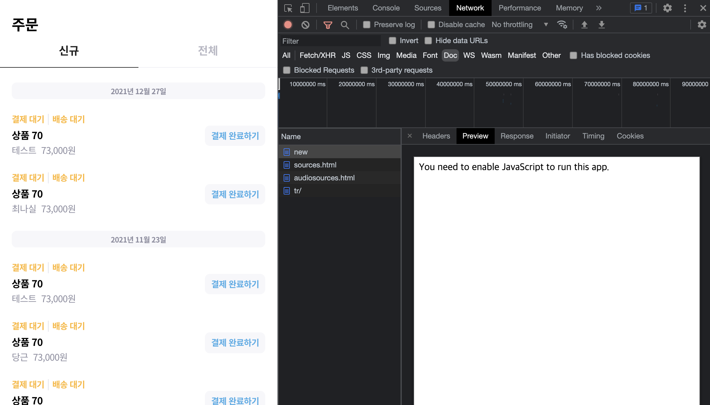

import Figure from "@/components/Figure.astro";
import Video from "@/components/Video.astro"; 


## 1. 소개

`react-snap`은 `puppeteer`를 사용하여 정적 HTML 파일들을 pre-rendering 해주는 라이브러리입니다. 

비슷한 라이브러리로는 `react-snapshot` 등이 있는데, [npm trends](https://www.npmtrends.com/react-snap-vs-react-snapshot)에서 `react-snap` 이 더 많은 다운로드 수를 가지고 있는 것을 확인할 수 있습니다.

<Figure>

</Figure>

그러나 전체적으로 다운로드 수가 점점 하락세인 걸로 보이는데요. 직접 써보니 생각보다 적용하면서 어려움이 있었습니다.

## 2. 설치

```bash
npm i react-snap -D
```

개발환경에서 사용하는 라이브러리이기 때문에 devDependency로 설치해줍니다. 

## 3. 설정

### 1) 스크립트 설정

```jsx
// package.json

"script": {
  // ...
  "postbuild": "react-snap"
}
```

공식 문서에서는 `postbuild` 를 사용해서 스크립트를 구성하도록 설명하고 있습니다.

`pre` 또는 `post`는 [npm scripts의 문법](https://docs.npmjs.com/cli/v7/using-npm/scripts)으로`package.json`의 scripts 섹션에서 사용되는 스크립트 이름 앞에 붙여서 매칭되는 이름의 스크립트가 실행되기 전이나 후에 원하는 스크립트를 실행해줍니다.

`build` 스크립트가 있다면 `build` 스크립트의 실행이 종료된 후 `postbuild` 에 작성한 스크립트가 이어서 실행될 거에요.

HTML을 pre-rendering 해야하는 원하는 시점이 있다면 `post` 훅을 사용하지 않고 별도 스크립트를 구성할 수도 있습니다. 

### 2) 라우터 설정

```jsx
// src/App.js

function App() {
  return (
    <>
      <h1>Home</h1>
      <Link to='/login'>login</Link>
      <Link to='/setting'>setting</Link>
    </>
  );
}
```

<Figure width="240px">

</Figure>

기본적으로 `react-snap`이 루트부터 HTML 구조를 파악해 모든 링크를 크롤링해주기 때문에 빌드된 결과물을 보면 path명으로 된 디렉토리와 그 하위에 index.html 파일이 생성된 것을 확인할 수 있습니다. 

pre-rendering 하고 싶거나 제외하고 싶은 특정 path가 있다면 package.json에서 `include`나 `exclude` 옵션을 사용해 따로 설정할 수도 있습니다.

```jsx
// package.json

"reactSnap": {
  "include": [
    "/",
    "/login",
    "/sign-up",
  ]
}
```

### 3) hydrate 설정

```jsx
// src/index.js

import React from 'react';
import { hydrate, render } from 'react-dom';
import App from './App';

const $root = document.getElementById('root');
const renderOrHydrate = $root.hasChildNodes() ? hydrate : render;

renderOrHydrate(<App />, $root);
```

index.js에서 `ReactDOM.render` 를 사용하던 부분도 바꿔주어야 합니다. 
root 요소에 자식 노드가 있는지 확인해서 없으면 자식 노드를 `render`하고, 있으면 `hydrate`합니다.

[`hydrate`](https://reactjs.org/docs/react-dom.html#hydrate)는 이미 있는 HTML에 이벤트리스너를 연결하는 등의 역할을 합니다. 

## 4. 테스트

### 1) 빌드

```bash
$ npm run build 
```

또는 프로젝트에 설정해 놓은 빌드 스크립트와 react-snap 스크립트를 실행합니다. 위와 같이 어떤 페이지들이 크롤링됐는지 볼 수 있어요.

<Figure>

</Figure>

스크립트 실행 시 어떤 일들이 일어나는지 궁금하다면 [이 문서](https://github.com/stereobooster/react-snap/blob/master/doc/behind-the-scenes.md)를 읽어보시면 도움이 될 거에요.

### 2) 빌드된 결과물 확인

<Figure width="240px">

</Figure>

build 디렉토리 안에 지정한 라우터의 html 파일과 200.html, 404.html 이 생성됩니다. 

### 3) 브라우저에서 확인

```bash
$ npx serve build 
```

[`serve`](https://github.com/vercel/serve) 는 정적 파일을 띄울 때 사용하는 라이브러리입니다. 

<Figure>

</Figure>

개발자 도구 Network탭에서 pre-rendering 한 페이지의 미리보기가 보인다면 정상적으로 작동된 거에요.

## 5. 겪은 문제점들

### 1) 서브도메인 구조에 적용 어려움

회사 프로젝트는 서브도메인 별로 서비스가 나뉘어져 있습니다. 그래서 url 파싱 후 각 서비스의 라우터로 나뉘게 되어 있는데, 크롤링 시 `http://localhost:45678` 주소로 접근되다보니 서브도메인을 인식하지 못 하는 문제가 있었습니다. 

이후 프로젝트를 모노레포로 리팩토링하면서 각 서비스가 별도 패키지로 분리되었는데, 그러면서 이 부분은 해결이 되었습니다. 

### 2) 로컬에서 제대로 적용이 안 됨

build 디렉토리 안에는 정상적으로 html 파일들이 생성되었는데 로컬에서 테스트하니 자꾸 미리보기에 루트 페이지가 뜨는 이슈가 있었습니다. 

로컬에서 build 디렉토리로 실행하는 법을 검색했더니 `npx serve -s build` 하라고 해서 따라했는데, `-s` 옵션이 문제였어요. `-s` 옵션은 찾지 못한 요청을 `index.html` 로 보낸다고 해요.

`server.json`을 생성해서 설정해주는 방법도 있지만, 간단하게 옵션을 빼고 `npx serve build` 로 실행시켰더니 정상적으로 페이지별 미리보기가 동작했습니다. 

<Figure caption="로그인 화면인데 자꾸 랜딩 화면이 나온다 🥲">

</Figure>


### 3) 크롤링 시 CORS 에러

puppeteer 환경이 `http://localhost:45678` 이라서 해당 IP와 포트에 열려있지 않은 API에는 접근이 불가합니다.

pre-rendering 하려는 페이지들이 정적 페이지여서 데이터 요청을 보낼 일은 없었지만, 직접 S3에 올려 가져다쓰던 폰트는 preview 화면에 적용되지 않았습니다.

실제 사용자가 진입할 때는 정상적으로 가져오기 때문에 큰 문제는 아니었습니다.

<Figure caption="크롤링 시 에러 메세지">

</Figure>

<Figure caption="폰트가 적용되지 않은 Preview">

</Figure>

<Figure caption="실제 화면">

</Figure>

### 4) 페이지 이동 간 깜빡이는 현상

<Figure caption="새로고침 시 깜빡임" width="280px">
  <Video src="/react-snap-ssg/flickering.mov" />
</Figure>


pre-rendering을 하지 않은 화면을 새로고침할 때 루트 화면이 잠시 깜빡이며 보이는 현상이 있었습니다. 

이유는 ‘/’ 페이지를 pre-rendering 하면서 build 디렉토리에 pre-rendering 된 index.html 이 담겼기 때문이었어요. 리액트는 비어있는 index.html 에 동적으로 화면을 그려내는데, index.html이 비어있지 않으니 깜빡이는 이슈가 발생했던 거죠. 

[react-snap 문서에 적혀있던 해결책](https://github.com/stereobooster/react-snap#service-workers)은 index.html의 prerender 되지 않은 버전인 200.html을 index.html 대신 사용하라는 것이었는데, 문서에 적힌 내용을 따라해서는 해결이 되지 않았습니다. 

그러면서 [이 이슈](https://github.com/stereobooster/react-snap/issues/484)를 발견했는데, `react-snap` 이 버그가 많고 현재 유지보수가 되지 않는 라이브러리라는 것을 이 때 알게 되었습니다. 검색할 때 제일 많이 나오길래 주의 깊게 보지 않고 가져다 썼는데, 제일 마지막 업데이트가 2년 전이더라구요. 그래서 계속 사용하는 게 맞을까 고민을 했지만, 몇 가지 테스트로 해결이 되어 사용하기로 했습니다. 

이 이슈는 `package.json` reactSnap 설정에서 `inlineCss: true` 옵션을 제거하니 해결되었습니다. 

### 5) 배포 시 nginx 설정

로컬에서는 이제 문제 없이 돌아가는데, 배포를 하니 또 문제가 생겼습니다. 이번엔 pre-rendering 한 페이지를 새로고침하면 url이 변경되는 이슈입니다. 💦

<Figure>

</Figure>

왼쪽 섹션을 보면 login 으로 요청 시 301 리다이렉트 되면서 `elb + login/` 으로 이동이 됩니다. 수많은 검색과 논의와 삽질 끝에 `nginx.conf` 파일을 수정해서 해결했습니다. 

기존 nging.conf 는 이렇게 되어 있었는데, 

```
location / {
    root   /usr/share/nginx/html;
    index  index.html index.htm;
    try_files $uri $uri/ /index.html =404;
}
```

아래 코드로 최종 수정했습니다.
```
location / {
    root   /usr/share/nginx/html;
    index  index.html index.htm;
    try_files $uri $uri/index.html /200.html =404;
}
```


1. `$url/` → `$url/index.html` 로 변경했더니 경로를 제대로 찾아서인지 리다이렉트 없이 일치하는 파일이 로드되었고,
2. `/index.html` → `/200.html` 로 변경했더니 pre-rendering 하지 않은 페이지의 미리보기를 원래 리액트의 그것처럼 흰 바탕으로 되돌릴 수 있었습니다. 

<Figure caption="fallback을 /index.html로 했을 때 - prerender된 index.html이 서브된다.">

</Figure>

<Figure caption="fallback을 /200.html로 변경했을 때">

</Figure>


react-snap 깃헙 이슈에서도 [비슷한 내용](https://github.com/stereobooster/react-snap/issues/447)을 찾을 수 있었습니다.

## 6. 마무리

react 프로젝트에서 정적 페이지의 SEO가 필요한 경우 next보다 간단한 react-snap을 많이 고려하실 것 같습니다. 
조금만 찾아봐도 자료들이 많고 언뜻 보기에 설정이 간단해서 금방 적용할 수 있을 것 같구요. 
저도 쉽게 생각하고 react-snap을 선택했었는데, 작업하면서 생각지 못한 이슈들이 있어 해결하기까지 꽤 고생을 했습니다.

react-snap의 도입을 고려하고 계시다면 이 라이브러리가 최근 관리가 잘 되지 않고 있다는 점을 염두에 두셨으면 좋겠습니다. 

맨 처음에 첨부한 이미지처럼 요즘에는 다운로드수가 떨어지는 추세인데, 아무래도 SEO를 염두에 둔다면 react가 아닌 다른 프레임워크를 선택하는 것이 낫기 때문일 것 같기도 하고요.
처음 프로젝트 구성할 때부터 SEO가 필요할 지 한 번 더 고민해보고 스택을 선택하면 좋을 것 같습니다.

## reference

- [stereobooster/react-snap](https://github.com/stereobooster/react-snap)
- [vercel/serve](https://github.com/vercel/serve)
- [[npm] scripts](https://docs.npmjs.com/cli/v7/using-npm/scripts)
- [[react] hydrate()](https://reactjs.org/docs/react-dom.html#hydrate)
- [[web.dev] Pre-render routes with react-snap](https://web.dev/prerender-with-react-snap/)
