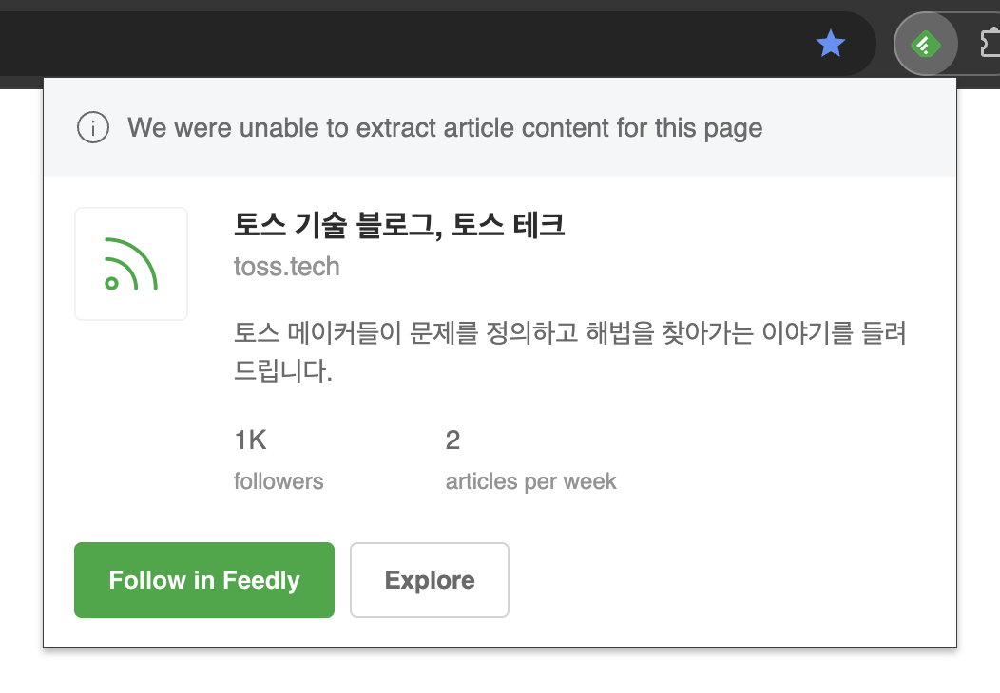
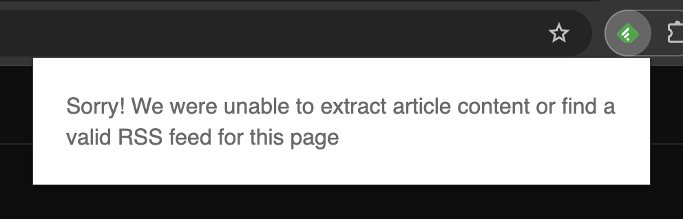
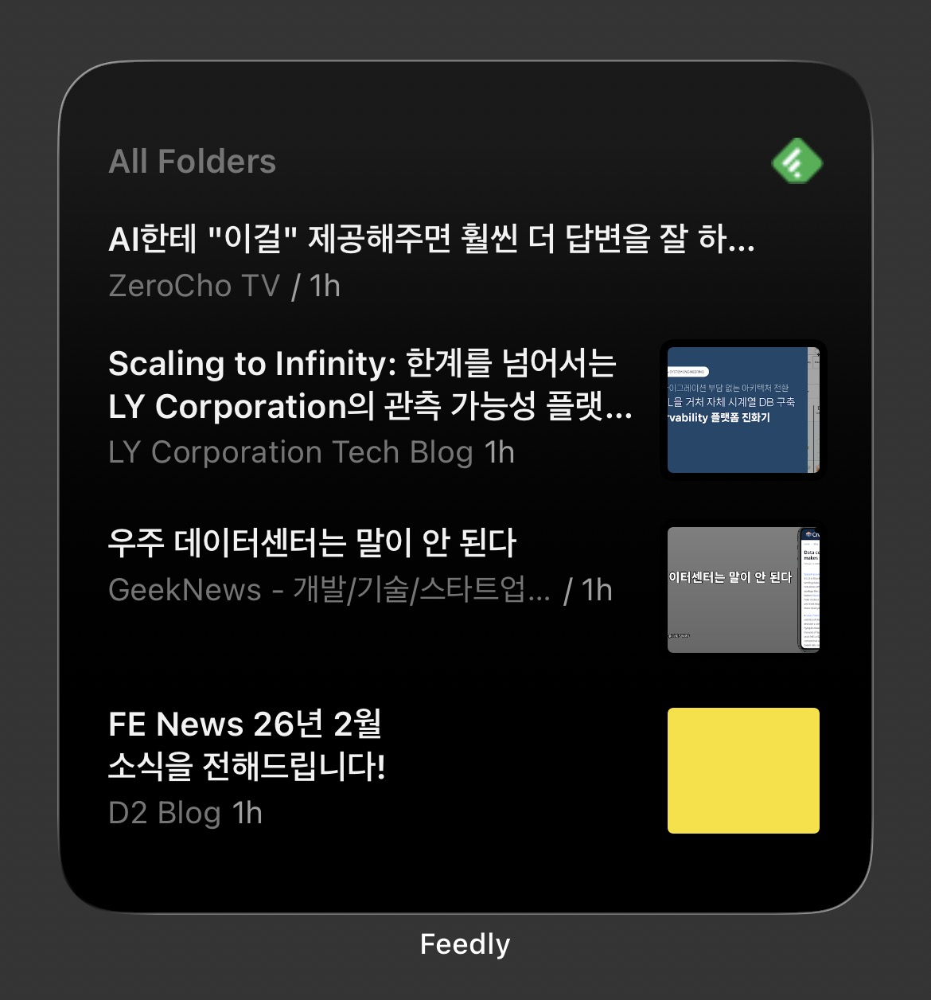

import Figure from "@/components/Figure.astro";

## 들어가며

멘토링이나 원온원을 진행하다보면 최신 개발 동향을 어디서 접해야 할지 모르겠다는 질문을 종종 받습니다. ‘취준생이라 정보를 얻을 곳이 없다’, ‘사수가 없어서 최신 트렌드를 알려줄 사람이 없다’는 고민을 듣곤 하는데, 회사나 커뮤니티에 속해있어야만 주변인들을 통해 정보를 얻을 수 있다고 생각하시는 것 같아요.

인터넷 세상에서 우리는 수많은 정보에 쉽게 접근이 가능합니다. 특히 개발 분야는 서로 노하우를 공유하는 환경과 분위기가 잘 갖춰져 있기 때문에 내가 노력하는만큼 양질의 정보를 얻을 수 있습니다.

오늘은 제가 개발 정보를 얻는 다양한 경로 중 RSS를 활용하는 방법에 대해 소개해드리겠습니다.

## RSS

RSS는 `Really Simple Syndication`의 약자로, 웹사이트의 새 콘텐츠를 자동으로 전달받을 수 있는 표준 방식입니다.

블로그나 뉴스 사이트가 글을 발행하면 RSS 피드에 업데이트된 내용이 담기고, 우리는 RSS 리더 앱을 통해 여러 사이트의 새 글을 한 곳에서 모아볼 수 있습니다. 관심 있는 블로그들을 즐겨찾기 해두고 매일 방문하지 않아도 되는거죠.

RSS를 지원하는 다양한 리더 앱들이 있는데, 저는 그 중 가장 널리 쓰이고 모바일 앱 지원이 잘 되는 [Feedly](https://feedly.com/)를 사용하고 있습니다.

## Feedly

전세계 수백만 명이 사용하는 대표적인 RSS 리더로, 웹 및 모바일 앱(iOS/Android)을 모두 제공합니다.

사용 방법은 간단합니다. 가입 후에 구독하고 싶은 사이트의 URL을 입력하거나, 초기 설정에서 관심 카테고리를 선택하면 됩니다. 기술 카테고리를 선택하면 국내 유명 테크 블로그들이 자동으로 추천되기 때문에 처음에는 그 중에서 관심있는 채널들을 골라 구독하시면 됩니다.

[Feedly에서 제공하는 크롬 익스텐션](https://chromewebstore.google.com/detail/feedly-mini/ndhinffkekpekljifjkkkkkhopnjodja?hl=en)을 사용하면, RSS 피드를 자동으로 찾을 수 있는 사이트는 바로 구독할 수 있습니다. 
피드를 발견하지 못했더라도 실제로는 RSS를 제공하는 경우도 있으니, 사이트 하단이나 메뉴에서 RSS 링크를 직접 찾아보세요.

<Figure caption="RSS 피드를 발견한 경우" width="500px">

</Figure>

<Figure caption="RSS 피드를 발견하지 못한 경우" width="500px">

</Figure>

 
모바일 앱을 설치하면 위젯 설정도 가능해서 업데이트되는 피드들을 배경화면에서 바로 확인할 수도 있습니다. 앱에는 ‘나중에 읽기’ 기능이 있어서 읽을 시간은 없지만 놓치기 싫은 글들을 저장해둘 수도 있고, 관심있는 글들을 폴더별로 모아둘 수도 있습니다.

<Figure caption="Feedly 모바일 앱 위젯" width="400px">

</Figure>

100개의 피드와 3개의 폴더까지는 무료로 사용할 수 있어 처음 시작하는 단계에서는 무료로도 충분합니다.

## 구독 중인 채널 소개

### 개발 블로그

저는 주로 테크 회사에서 운영하는 블로그와 개발자분들의 블로그를 구독하고 있어요.

- [GeekNews](https://news.hada.io/) [(RSS)](https://feeds.feedburner.com/geeknews-feed)

- [Korean FE article](https://kofearticle.substack.com/) [(RSS)](https://kofearticle.substack.com/feed)

- [네이버 D2 Blog](https://d2.naver.com/home) [(RSS)](http://d2.naver.com/d2.atom)

- [카카오 테크 블로그](https://tech.kakao.com/blog) [(RSS)](http://tech.kakao.com/rss/)

- [토스 기술 블로그, 토스 테크](https://toss.tech/) [(RSS)](https://toss.tech/rss.xml)

- [당근 테크 블로그](https://medium.com/daangn) [(RSS)](https://medium.com/feed/daangn)

개인 블로그는 각자 선호하는 관심 분야와 스타일이 달라 직접 찾아보시기를 권장드리는데요,
예전에는 [어썸데브블로그](https://awesome-devblog.netlify.app/)에서 개인 블로그 목록을 제공해줘서 참고하곤 했었는데 이 글을 작성하며 확인해봤을 때는 잘 관리가 되고 있지 않은 것 같아요.
이런 기능을 제공하는 또다른 곳이 있을까요? 아시는 분은 댓글로 공유 부탁드립니다! 

Velog의 특정 계정을 구독하고 싶은 경우는`https://v2.velog.io/rss/@사용자아이디` 형식으로 구독하시면 됩니다.

### 유튜브

유튜브도 RSS 구독 가능한 것 아시나요? 매년 다양한 테크 컨퍼런스 영상이 올라오지만 알고리즘에 묻혀 놓치기 쉬운데, RSS 구독으로 빠뜨리지 않고 챙겨볼 수 있습니다.

유튜브 채널 홈에서 ‘페이지 소스 보기’한 후 `type="application/rss+xml"` 을 검색하면 link태그의 href 속성값(`https://www.youtube.com/feeds/videos.xml?channel_id=채널ID` 형식)을 찾을 수 있습니다. 이 URL을 복사해서 Feedly에 추가하면 됩니다.

<Figure>

</Figure>

네이버, 카카오, 당근은 테크 전용 계정을 따로 운영하고 있어 채널 ID를 그대로 사용했고, 토스는 브랜드 계정이지만 SLASH 컨퍼런스를 별도 플레이리스트로 제공하고 있어 플레이리스트 ID로 구독하고 있습니다.

- [FEConf Korea](https://www.youtube.com/@feconfkorea) [(RSS)](https://www.youtube.com/feeds/videos.xml?channel_id=UCWEzfYIpFBIG5jh6laXC6hA)
- [NAVER D2](https://www.youtube.com/@naver_d2) [(RSS)](https://www.youtube.com/feeds/videos.xml?channel_id=UCNrehnUq7Il-J7HQxrzp7CA)
- [kakao tech](https://www.youtube.com/@kakaotech) [(RSS)](https://www.youtube.com/feeds/videos.xml?channel_id=UCdQF7F6hwjSpulj_fwB9iDQ)
- [당근테크](https://www.youtube.com/@daangntech) [(RSS)](https://www.youtube.com/feeds/videos.xml?channel_id=UCwNwSGlLJNZTatOnE2t33tg)
- [우아한테크](https://www.youtube.com/@woowatech) [(RSS)](https://www.youtube.com/feeds/videos.xml?channel_id=UC-mOekGSesms0agFntnQang)
- [토스 > SLASH | 개발자 컨퍼런스](https://www.youtube.com/playlist?list=PL1DJtS1Hv1PiGXmgruP1_gM2TSvQiOsFL) [(RSS)](https://www.youtube.com/feeds/videos.xml?playlist_id=PL1DJtS1Hv1PiGXmgruP1_gM2TSvQiOsFL)

## 커스텀 RSS 생성

모든 사이트에서 RSS를 제공하면 좋겠지만 아쉽게도 RSS를 제공하지 않는 사이트도 있습니다.

저는 Velog의 트렌딩 페이지를 종종 확인하는데요, Velog는 개별 계정의 RSS는 제공하지만 전체 목록에 대한 RSS는 제공하지 않습니다.
또, 컨퍼런스 영상을 구독하고 싶은데 인프런처럼 컨퍼런스 전용 채널이 없는 경우, 계정 전체를 구독하면 관심 없는 콘텐츠까지 함께 받게 됩니다.

이런 경우 [RSS.app](RSS.app) 같은 서비스를 사용해서 커스텀 RSS를 생성할 수 있지만 대부분 유료입니다. 그래서 저는 GitHub Actions을 활용해 필요한 데이터를 직접 크롤링하거나 필터링해서 RSS 피드를 직접 생성 및 구독하고 있습니다.

아래는 제가 직접 생성한 RSS 피드입니다. 관심있는 분들은 아래 URL을 사용해 구독하셔도 돼요.

- [Velog 주간 트렌딩](https://velog.io/) [(RSS)](https://choinashil.github.io/rss-feeds-generator/velog-trending.xml)

- [네이버 컨퍼런스 DAN](https://www.youtube.com/@naverofficial) [(RSS)](https://choinashil.github.io/rss-feeds-generator/naver-conference.xml)

- [인프런 컨퍼런스 INFCON](https://www.youtube.com/@inflearn_official) [(RSS)](https://choinashil.github.io/rss-feeds-generator/inflearn-conference.xml)

구현 코드는 [이 레포지토리](https://github.com/choinashil/rss-feeds-generator)에서 확인하실 수 있습니다.

## 마치며

저는 요즘 인스타그램보다 Feedly 앱을 더 자주 이용하면서 하루에도 다양한 글들을 접하고 있는데요. RSS로 나만의 개발 뉴스레터를 만들고, 일상에서 자연스럽게 개발 콘텐츠를 접할 수 있는 환경을 만들어보세요. 내가 직접 큐레이션한 채널에서 더 깊이 있는 인사이트를 얻을 수 있을 거에요.

참고로 제 블로그도 [RSS](/rss.xml)를 제공하고 있으니 관심있으시면 구독 부탁드려요!