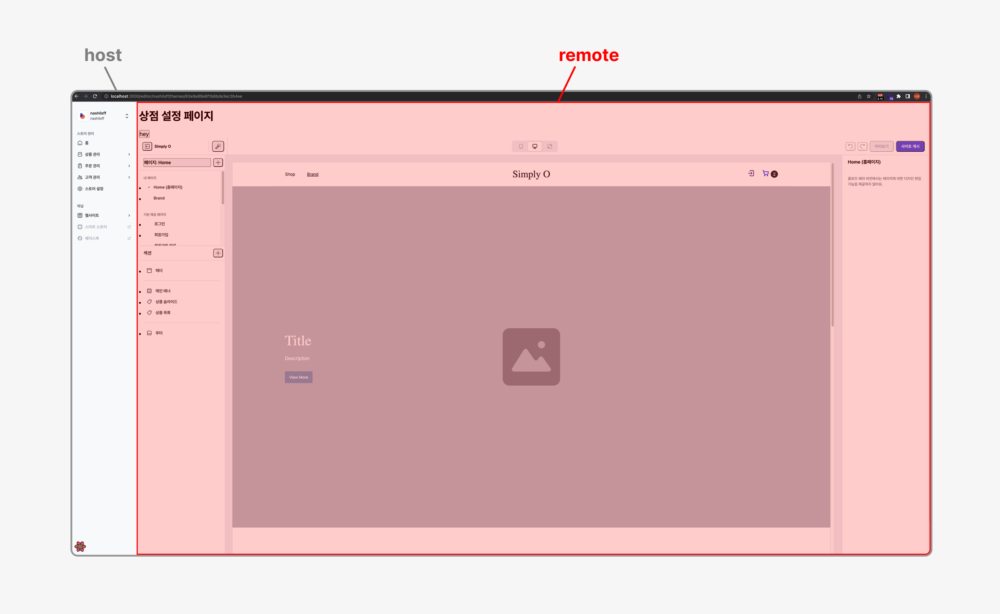
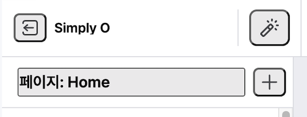
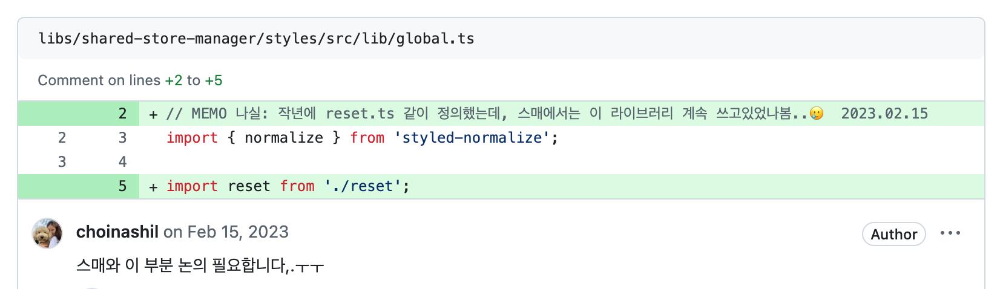
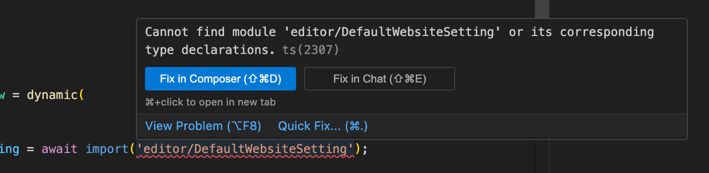
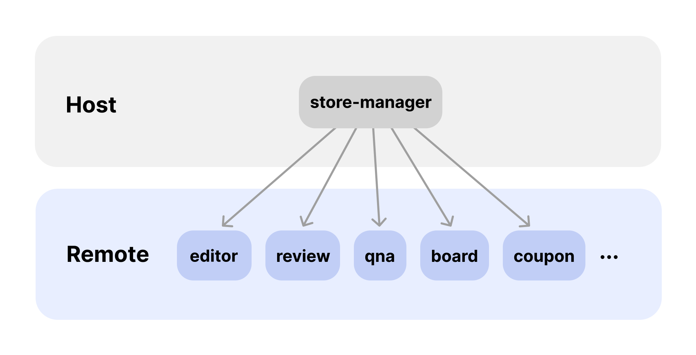
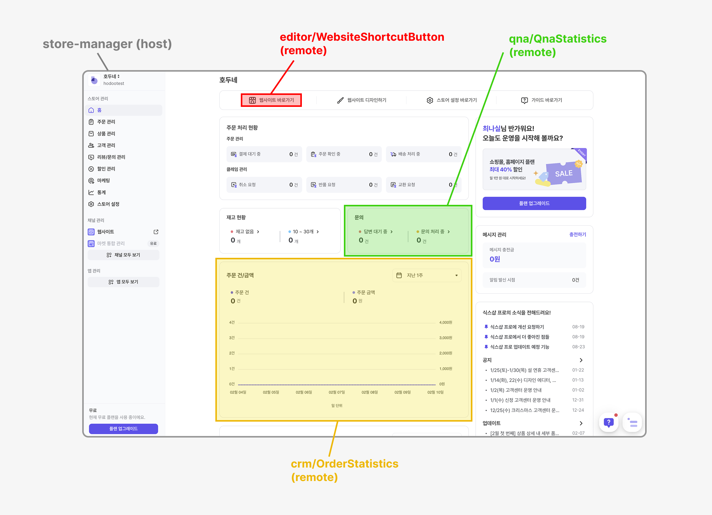

import Callout from '@/components/Callout.astro';
import Figure from "@/components/Figure.astro";

[마이크로 프론트엔드](https://micro-frontends.org/)는 **프론트엔드 애플리케이션을 작은 단위로 분리하여 독립적으로 개발, 배포, 운영할 수 있게 하는 아키텍처**입니다. 
이 글에서는 식스샵에서 마이크로 프론트엔드를 도입하게 된 배경과 적용 과정, 그리고 그 결과를 공유하고자 합니다.

## 도입 배경

‘식스샵 프로’라는 신규 제품에 착수하면서 각 기능들을 앱으로 분리하여 [모노레포로 운영](/posts/sixshop-monorepo)하고 있었습니다.

2023년 2월, 스토어프론트 앱의 웹사이트 설정 화면을 스토어 매니저 앱의 화면 안에 띄워야 하는 요구사항이 생겼습니다.

당시 모노레포에는 

1. 스토어 매니저 (판매자향, 이하 A)
2. 에디터 (판매자향, 이하 B)
3. 웹사이트 (구매자향, 이하 C) 

3개의 앱이 있었는데, 처음으로 판매자향 제품(A, B)끼리 통합하게 된 것입니다.

이미 각 앱이 분리되어 있었기 때문에 빌드 타임 통합은 고려하지 않았고, 런타임 통합 방식을 고민했습니다.
iframe 등의 의견이 나왔었는데, 마침 [Webpack 5 Module Federation으로 Micro-Frontends 운영하기](https://youtu.be/0Eq6evGKJ68?si=OljkRbrHePZXp6zG)라는 FEConf Korea 영상을 흥미롭게 봤던 터라 Module Federation을 제안하여 PoC를 진행했습니다.

## 초기 테스트 단계에서 겪은 이슈들

두 앱의 `next.config.js`에 Module Federation 관련 설정을 추가하는 것만으로도 기본적인 통합은 가능했지만, 실제 적용 과정에서 몇 가지 예상치 못한 문제들이 발생했습니다.

### 1. 스타일 충돌 이슈

A앱과 B앱의 reset CSS 설정이 달라 B앱의 스타일이 깨지는 현상이 발생했습니다.

<Figure>

</Figure>
<Figure caption='remote 앱(빨간 영역)에 reset CSS가 적용되지 않았다'>

</Figure>

호스트 앱(A)에서 리모트 앱(B)을 import하면, 호스트 앱의 DOM 트리 내에 리모트 앱의 모듈이 렌더링되기 때문에 호스트 앱의 전역 CSS는 리모트 앱의 모듈들에 영향을 줍니다.

사내에는 프론트엔드 레벨에서 통일된 reset CSS 규칙이 있었고, B앱은 이를 바탕으로 스타일링이 되어있었습니다.
하지만 A앱에 B앱을 import하니 reset CSS가 적용되지 않았는데, A앱에 reset CSS가 규칙과 다르게 적용되어있던 것이 원인이었습니다.

<Figure>

</Figure>

reset CSS는 Next.js 구조상 `_app.tsx` 를 통해 적용이 되는데, 리모트 앱의 모듈은 컴포넌트 단위로 export, import 될 수 있다보니 `_app.tsx` 를 거치지 않아 B앱의 reset CSS가 적용이 되지 않았고, A앱 내에서 렌더링되면서 A앱의 전역 스타일이 적용된 것입니다.

우선 두 앱에 동일한 공통 스타일을 적용하여 해결했지만, 추후 써드파티 앱과의 통합을 고려한다면 스타일의 통일보다는 각 앱의 스타일을 격리하는 방향으로 개선이 필요할 것 같습니다.

### 2. 타입 관련 이슈

리모트 앱을 동적으로 import하는 과정에서 호스트 앱 빌드 시 타입 에러가 발생했습니다.

<Figure caption="에러 메세지: Cannot find module 'editor/DefaultWebsiteSetting' or its corresponding type declarations.">

</Figure>

Module Federation은 런타임에 모듈을 동적으로 import하는데, 타입스크립트는 빌드 타임에 타입을 체크하므로 동적으로 로드되는 모듈의 타입 정보를 알 수 없습니다.
따라서 호스트 앱에 타입 정의 파일(`.d.ts`)을 추가하여 리모트 모듈의 타입 정보를 전달해야 합니다.

저희는 임시로 아래와 같이 해결했지만, 

```tsx
declare module 'editor/*';
```

모듈마다 구체적인 타입을 지정하는 것을 권장합니다. props의 타입까지 정의하면 IDE에서도 타입 추론 및 자동 완성 기능을 사용할 수 있어 편리하기 때문입니다.

```tsx
declare module 'editor/DefaultWebsiteSetting' {
  const Component: React.ComponentType<DefaultWebsiteSettingProps>;
  export default Component;
}
```

하지만 이 방법도 아쉬운 점이 있는데요. 타입 정의 파일은 호스트 앱에 작성해야하는데, 호스트 앱이 리모트 모듈의 타입 정보를 직접 정의하다보니 타입이 불일치하거나, 이후에 타입이 달라졌을 때 동기화 문제가 생길 수 있다는 점입니다.

자바스크립트만 지원하고 있는 npm 라이브러리를 타입스크립트 프로젝트에서 사용 시 직접 타입 정의를 하는 것과 같은 상황이라고 생각하시면 됩니다.

현재는 모노레포 내에서 작업자가 리모트 모듈 개발과 호스트 앱에서의 import를 같이 작업하기 때문에 직접 타입을 정의하는 방식으로 처리하고 있습니다.


## 기술 스택 결정 과정

PoC를 통해 Module Federation의 적용 가능성을 확인했고, 다음과 같은 요구사항을 고려하여 최종 결정을 내렸습니다.

### 1. 확장성

당시에는 A앱과 B앱의 통합만 필요했지만, 향후 여러 커머스 기능들이 독립적인 앱으로 분리될 예정이었고 다양한 앱들의 화면이 호스트 앱(A)에 통합되어야 했습니다.

### 2. 써드파티 지원 계획

장기적으로는 외부 개발자가 제공하는 써드파티 앱도 수용할 수 있어야 합니다. 아이폰처럼 호스트 앱을 플랫폼화하고, 앱스토어를 제공하여 사용자가 원하는 기능의 앱을 추가할 수 있도록 하는 것이 미션이었습니다.

이 과정에서 발견한 Module Federation의 단점이 있었는데, 호스트 앱의 `next.config.js`에 리모트 앱의 remoteEntry 경로가 포함되어야 한다는 점입니다. 이는 써드파티 앱이 추가될 때마다 호스트 앱이 영향을 받게 된다는 의미입니다.

```jsx
// 호스트 앱의 next.config.js
const getRemoteEntryUrl = (isServer, hostUrl) => {
  const location = isServer ? 'ssr' : 'chunks';
  return `${hostUrl}/_next/static/${location}/remoteEntry.js`;
};

new NextFederationPlugin({
  name: 'store-manager',
  filename: 'static/chunks/remoteEntry.js',
  remotes: {
    // 리모트 앱의 경로가 포함되어야 함
    editor: `editor@${getRemoteEntryUrl(isServer, EDITOR_URL)}`,
    review: `review@${getRemoteEntryUrl(isServer, REVIEW_URL)}`,
    qna: `qna@${getRemoteEntryUrl(isServer, QNA_URL)}`,
    board: `board@${getRemoteEntryUrl(isServer, BOARD_URL)}`,
    coupon: `coupon@${getRemoteEntryUrl(isServer, COUPON_URL)}`,
    point: `point@${getRemoteEntryUrl(isServer, POINT_URL)}`,
		// ...
  },
})
```

그럼에도 불구하고 **Module Federation을 선택한 이유**는 다음과 같습니다.

### 1. 성능과 사용자 경험

Module Federation을 사용한 통합은 iframe 대비 더 나은 성능과 자연스러운 UI/UX를 제공합니다.

shared 옵션을 통해 React, styled-components 등 공통 모듈을 공유할 수 있어, 여러 앱이 각각 리소스를 중복으로 로드하지 않아도 됩니다.
또한, 호스트앱의 DOM 트리 내에 리모트 모듈이 렌더링되기 때문에 iframe을 사용할 때보다 반응형이나 스크롤 처리가 자연스럽습니다.

### 2. 개발 편의성

각 앱을 독립적으로 개발하면서도 런타임에서 모듈 단위의 세밀한 통합이 가능합니다.

iframe이 페이지 단위로만 통합이 가능한 것과 달리, Module Federation은 개별 컴포넌트 외에도 상수나 타입, 유틸 함수 등 다양한 타입의 모듈을 공유할 수 있습니다.

데이터 통신 측면에서도 `postMessage`를 통해 처리해야하는 iframe과 비교했을 때 Module Federation은 일반적인 React 컴포넌트처럼 props를 직접 전달할 수 있어 편리합니다.

또한 브라우저 개발자 도구나 React DevTools 등에서 단일 앱처럼 컴포넌트 계층 구조 확인이나 디버깅이 편리한 것도 개발 생산성을 높여주는 점입니다.

```tsx
// Module Federation: props로 전달
const RemoteComponent = dynamic(() => import('remote/Component'));
<RemoteComponent title="제목" onSubmit={handleSubmit} />

// iframe: postMessage로 전달 
<iframe src="/remote" onLoad={() => {
  iframe.contentWindow.postMessage({ type: 'UPDATE', title: "제목" }, '*')
}} />

window.addEventListener('message', (event) => {
  if (event.data.type === 'SUBMIT') {
	  handleSubmit(event.data);
  }
});
```

### 3. 현실적인 판단

써드파티 확장은 아직 먼 미래의 요구사항이었기에, 우선은 내부 앱 통합에 최적화된 솔루션을 선택했습니다. 써드파티 지원을 위한 구조 개선은 추후 점진적으로 진행하기로 했습니다. 


## 도입 과정

### 설계

<Figure>

</Figure>

Module Federation은 양방향 참조가 가능하지만, 앱 간 의존성을 명확하게 관리하기 위해 단방향 구조를 채택했습니다.

- 호스트 앱: 다른 앱들의 컴포넌트를 통합하여 보여주는 컨테이너 역할
- 리모트 앱: 각자의 도메인에 맞는 기능을 독립적으로 제공

스토어 매니저 앱(A)이 다른 앱들의 기능을 통합하여 보여주는 허브 역할이었기 때문에 프로젝트 요구사항과도 잘 맞았습니다.

### 라이브러리 선택

Next.js 환경에서 Module Federation을 직접 구성하는 대신 `@module-federation/next-mf`라는 라이브러리를 적용하기로 했습니다.

당시 참고했던 여러 자료들에 따르면 Next.js는 자체적인 웹팩 설정과 빌드 프로세스를 가지고 있어 일반적인 Module Federation 설정을 직접 적용하기 까다로운 점이 있는데, 이 라이브러리를 사용하면 이런 부분들을 직접 관리하지 않아도 되는 장점이 있다고 합니다.

특히 이 라이브러리는 내부적으로 Next.js 앱에서 사용되는 기본적인 라이브러리를 shared 옵션으로 제공하여 직접 설정하지 않아도 되어 편리합니다.

```tsx
export const DEFAULT_SHARE_SCOPE: SharedObject = {
  'next/dynamic': {
    requiredVersion: undefined,
    singleton: true,
    import: undefined,
  },
  'next/head': {
    requiredVersion: undefined,
    singleton: true,
    import: undefined,
  },
  'next/link': {
    requiredVersion: undefined,
    singleton: true,
    import: undefined,
  },
  'next/router': {
    requiredVersion: false,
    singleton: true,
    import: undefined,
  },
  'next/image': {
    requiredVersion: undefined,
    singleton: true,
    import: undefined,
  },
  'next/script': {
    requiredVersion: undefined,
    singleton: true,
    import: undefined,
  },
  react: {
    singleton: true,
    requiredVersion: false,
    import: false,
  },
  'react/': {
    singleton: true,
    requiredVersion: false,
    import: false,
  },
  'react-dom/': {
    singleton: true,
    requiredVersion: false,
    import: false,
  },
  'react-dom': {
    singleton: true,
    requiredVersion: false,
    import: false,
  },
  'react/jsx-dev-runtime': {
    singleton: true,
    requiredVersion: false,
  },
  'react/jsx-runtime': {
    singleton: true,
    requiredVersion: false,
  },
  'styled-jsx': {
    singleton: true,
    import: undefined,
    version: require('styled-jsx/package.json').version,
    requiredVersion: '^' + require('styled-jsx/package.json').version,
  },
  'styled-jsx/style': {
    singleton: true,
    import: false,
    version: require('styled-jsx/package.json').version,
    requiredVersion: '^' + require('styled-jsx/package.json').version,
  },
  'styled-jsx/css': {
    singleton: true,
    import: undefined,
    version: require('styled-jsx/package.json').version,
    requiredVersion: '^' + require('styled-jsx/package.json').version,
  },
};
```

### 모듈 내보내기 최적화

처음에는 `index.ts`를 통해 앱의 모든 모듈들을 한 번에 내보내는 방식을 사용하여 모듈이 추가될 때마다 `next.config.js`를 수정하지 않아도 되도록 했습니다.

```jsx
module.exports = {
  webpack: (config, options) => {
    config.plugins.push(
      new NextFederationPlugin({
        name: 'remote1',
        filename: 'static/chunks/remoteEntry.js',
        exposes: {
          './modules': './modules/index.ts', // 한 번에 내보내기
        }
      })
    );
    return config;
  }
};
```

하지만 이 방식은 웹팩이 빌드 시점에 어떤 모듈이 어디서 사용될지 알 수가 없다보니 트리 쉐이킹이 효율적으로 되지 않아 번들 크기가 불필요하게 커지는 문제가 있었습니다. 따라서 다음과 같이 필요한 모듈만 직접 expose하는 방식으로 변경했습니다.

```jsx
module.exports = {
  webpack: (config, options) => {
    config.plugins.push(
      new NextFederationPlugin({
        name: 'remote1',
        filename: 'static/chunks/remoteEntry.js',
        exposes: {
          './MyTheme': './modules/theme/MyTheme.tsx',
          './ThemeTemplatePreview': './modules/theme/ThemeTemplatePreview.tsx',
          './WebsiteShortcutButton': './modules/theme/WebsiteShortcutButton.tsx',
          // ...
        }
      })
    );
    return config;
  }
};
```


## 적용 결과와 한계점

현재 A앱은 10개가 넘는 독립적인 앱들이 모여 하나의 통합된 서비스를 제공하는 구조로 운영되고 있습니다. 각 앱은 자신의 도메인에 맞는 기능을 제공하면서도 사용자에게는 하나의 일관된 서비스로 보여집니다.

<Figure>

</Figure>

Module Federation을 적용하고 운영하면서 느낀 장점은 다음과 같습니다.

### 코드 관리 용이성

각 앱의 책임과 역할이 명확하게 분리되어 있어 도메인별로 코드 관리와 유지보수가 쉬워졌습니다.

### 배포 효율성 향상

특정 기능의 수정이 필요한 경우 해당 앱만 배포하여 빠르게 반영할 수 있습니다. 만약 하나의 앱에 모든 기능이 포함되어 있었다면, 특정 기능의 일부분이 수정될 때마다 전체 앱을 매번 배포해야해서 시간도 오래 걸리고 번거로웠을 것입니다.

### 장애 격리

특정 앱에 문제가 다른 앱으로 전파되지 않아 서로 미치는 영향을 최소화할 수 있습니다. 특정 부분에 문제가 발생하더라도 해당 앱만 수정해서 빠르게 배포하거나 빠르게 롤백할 수 있어 장애 대응이 용이합니다.

반면, 적용 후 운영을 하면서 알게된 개선이 필요한 부분도 있습니다.

### UI 통합의 제약

앱 간 긴밀한 통합이 필요한 경우 제약이 있습니다. 하나의 앱이라면 서로 엮이는 부분에 대한 UI 구현이 용이할텐데, 서로 다른 앱에서 불러온 모듈끼리 합치는 데 한계가 있다보니 디자이너가 제안한 UI를 그대로 구현하지 못 하는 경우가 있었습니다.

### 메모리 누수 이슈

언젠가부터 A와 B앱을 로컬 환경에서 작업하던 중에 메모리 누수로 서버가 꺼지는 일이 잦아졌습니다.
앱에 기능이 많고 최적화가 잘 안 되어 그런 줄 알았는데, `next.config.js`에서 Module Federation 관련 설정을 주석처리하면 괜찮다는 걸 알게 됐습니다. 
그래서 찾아보니 `@module-federation/next-mf` 라이브러리 자체에 메모리 누수 이슈가 있다는 것을 깃헙 이슈를 통해 알게 됐습니다.

<Callout emoji='💡'>
참고
- [Memory leak when running dev server for exposed component](https://github.com/module-federation/core/issues/717)
- [NextFederationPlugin is crashing on bigger project](https://github.com/module-federation/core/issues/718)
</Callout>


로컬에서의 작업과 배포 시 불편한 수준이 되어 1차적으로 `@module-federation/next-mf`의 버전을 올려 약간의 개선을 해놓은 상태입니다.


## 앞으로의 과제

### 메모리 누수 문제 해결

여러 앱을 켜놓고 작업하거나 변경사항이 많은 경우 서버가 꺼지는 일이 종종 있는데, 최신 버전의 `@module-federation/next-mf`를 적용해도 완벽한 해결이 되지 않아 라이브러리 자체의 문제인지 다른 원인이 있는지 확인 및 개선이 필요합니다.

### `@module-federation/next-mf` 유지여부 결정

메모리 누수 문제를 해결하기 위해 `@module-federation/next-mf` 라이브러리의 이슈를 살펴보면서 알게된 점인데, 2024년 11월부터 해당 라이브러리에서 Next.js의 지원을 중단했습니다.

<Callout emoji='💡'>
참고
- [Next.js Support is in maintenance mode](https://github.com/module-federation/core/issues/3153)
</Callout>

이슈를 살펴보면 Next.js 버전 업데이트 시마다의 호환성 문제와 Vercel의 협력 이슈로 유지보수가 어려워 2026년 중반까지 최소한의 유지보수만 지원한다고 합니다.

Next.js와 `@module-federation/next-mf`의 조합으로 마이크로 프론트엔드를 구축해온 우리 팀에게는 중대한 이슈로, 다른 방식을 찾아야 하는 상황입니다.

### 앱 간 상태 공유와 통신을 위한 매커니즘 구축

여러 프론트엔드 앱들을 빠르게 통합하는 것에 중점을 두다보니 앱 간 인증 정보 등 상태를 공유하기 위해 recoil을 싱글턴으로 공유하고 있습니다. 
또한, 호스트앱인 A와 리모트앱인 B가 통신하는 방식에 대한 정의가 명확히 되지 않아 케이스에 따라 개발자의 재량으로 처리된 부분들이 있습니다.

전체 서비스가 MSA 구조이므로 인증 등의 정보는 각 앱이 서버를 통해 받아오도록 하고, 화면단 제어가 필요한 부분은 SDK를 리모트 앱에 제공하는 등 매커니즘의 정렬이 필요합니다.

### 써드파티 앱 통합을 위한 구조 설계

처음 Module Federation 도입 시 리모트 앱의 추가/삭제 시점마다 호스트 앱에 영향을 주는 점을 임시적으로 무시(?)하고 결정을 했었는데, 슬슬 써드파티 앱 도입을 위한 설계가 필요해지고 있습니다.

향후 과제들을 작성하면서 보니, `@module-federation/next-mf`를 통한 Module Federation 적용이 편리한 점도 있지만 불안정한 점도 있는 것 같네요. 2년 가까이 운영해오면서 느낀 장단점을 고려하여 장기적으로 시스템에 영향이 덜 가는 방법으로 개선이 필요할 것 같습니다. 


## 마치며

마이크로 프론트엔드 아키텍처 도입은 개념부터 생소한 큰 도전이었지만, 보다 유연하고 확장 가능한 프론트엔드 시스템을 구축하는 기반이 되었습니다. MSA 구조와 궁합이 잘 맞는 설계라고 생각하지만 아직 해결해야 할 과제들도 많습니다.

개인적으로 마이크로 프론트엔드라는 개념이 매력적으로 느껴져서, 적용과 운영 과정에서 어려움이 있었음에도 불구하고 지속적으로 개선하며 사용하고 싶다는 생각이 들었습니다. 

특히 기능별로 역할이 명확하게 분리되고, 필요한 부분만 동적으로 불러와서 조립하는 방식이 기존 번들러들의 모듈화 개념을 확장하고 발전시키다는 점에서 인상적이었습니다. 
과거에는 동일한 프로젝트 내에서만 모듈 공유가 가능했다면, 이제는 서로 다른 기술 스택과 개발 환경에서도 런타임에서 유연하게 통합할 수 있다는 점이 앞으로의 프론트엔드 아키텍처에 새로운 가능성을 열어준다고 생각합니다.

이러한 경험이 비슷한 도전을 앞둔 다른 개발자들에게도 도움이 되길 바라며, 특히 Next.js 환경에서 Module Federation을 도입하고자 하는 팀들에게 좋은 참고가 되었으면 합니다.
