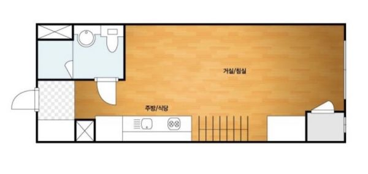
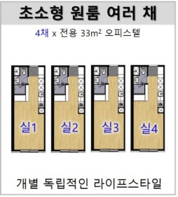
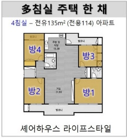
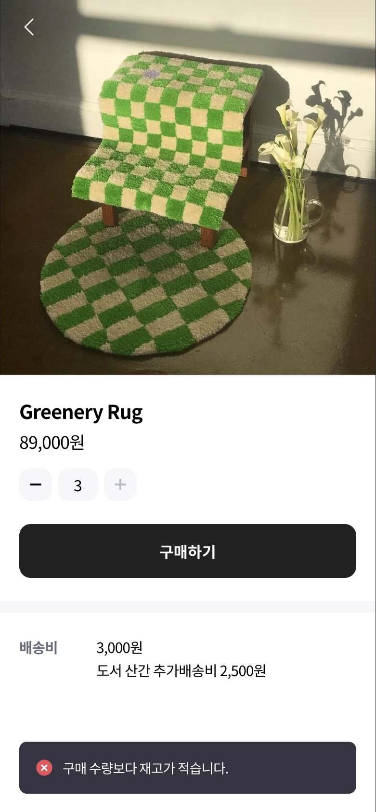
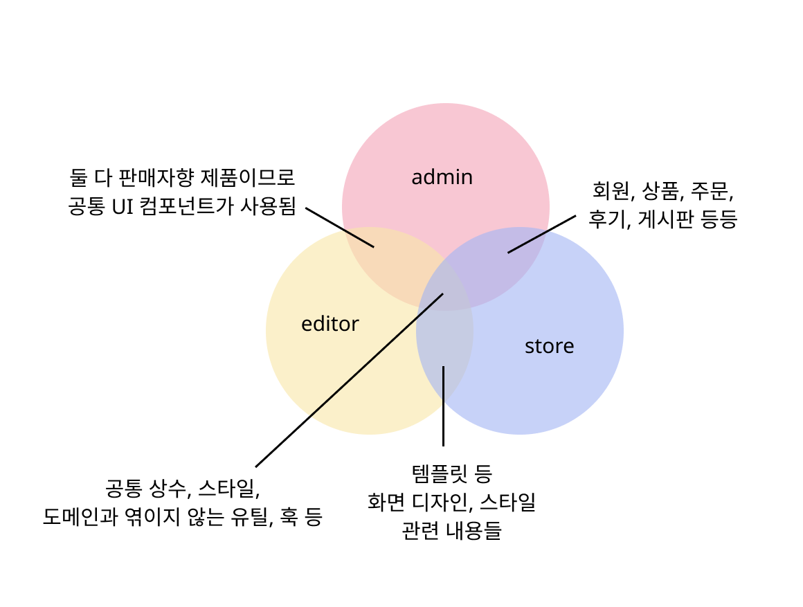
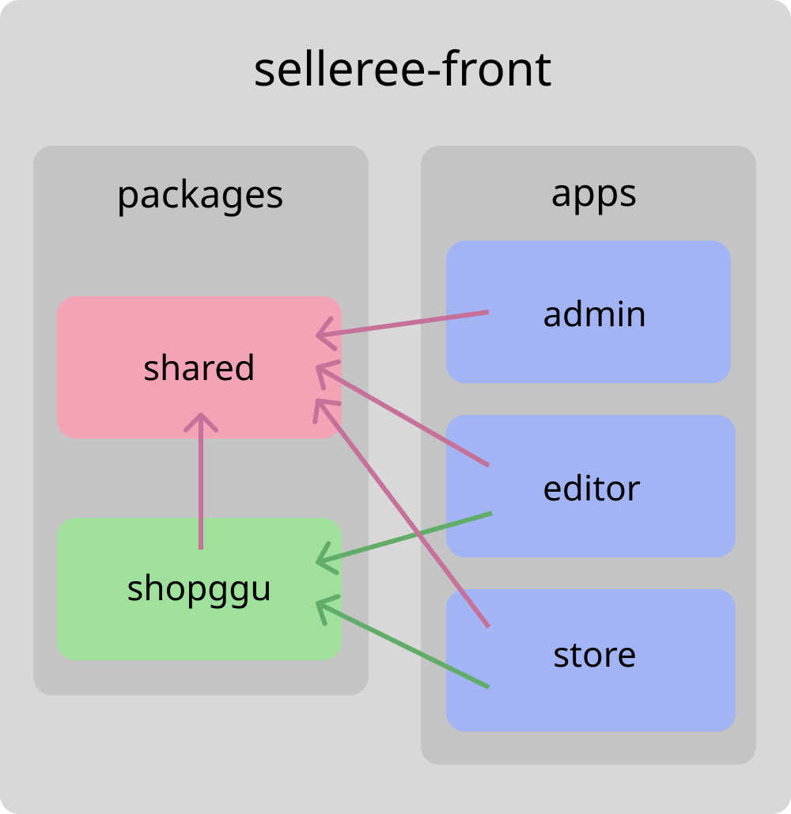
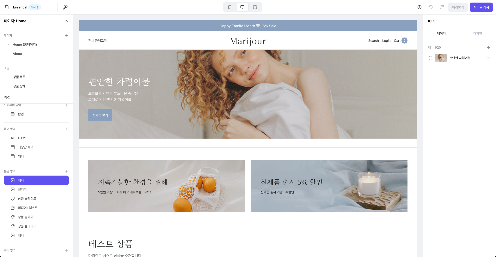
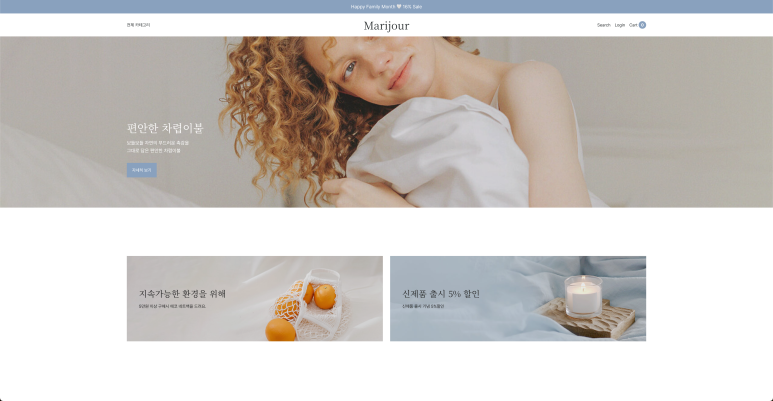
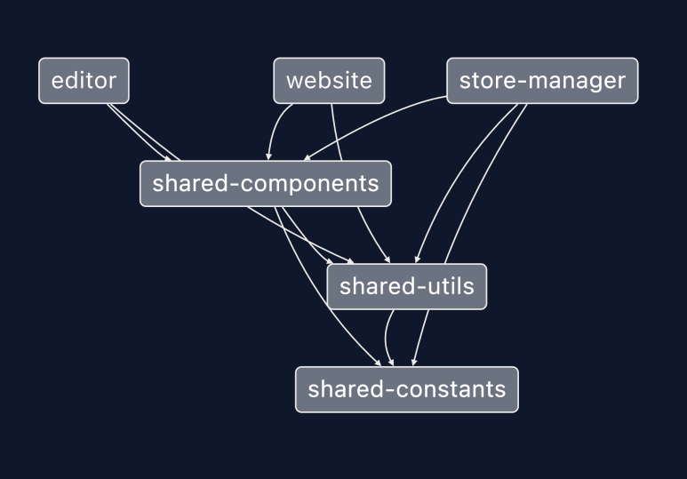

import Callout from '@/components/Callout.astro';
import Figure from "@/components/Figure.astro";
import Video from "@/components/Video.astro"; 

이번 포스팅에서는 모노레포의 개념을 비유와 함께 간단히 소개하고, 실제 식스샵 프론트엔드 어플리케이션에 적용한 과정을 소개하고자 합니다.

## 1. 모노레포 쉽게 이해하기

### 1) 레포지토리의 유형

프로젝트를 처음 시작할 때 레포지토리를 다양하게 구성할 수 있는데요. 이 때 레포지토리를 집으로, 프로젝트를 방으로 비유하여 여러 레포지토리 유형에 대해 알아봅시다.

#### a. 모놀리스

모놀리스 구조는 방이 나눠져있지 않은 집, 즉 **원룸**을 생각하시면 됩니다.

<Figure caption="출처: https://m.ggumim.co.kr/star/view/4081" width="480px">

</Figure>


| 비유 | 레포지토리 관점 |
| --- | --- |
| 새로운 입주자가 등장했을 때 | 서비스나 기능이 추가될 때 |
| 방이 없기 때문에 | 하나의 레포지토리에 하나의 프로젝트만 존재하기 때문에 |
| 원하는 곳에 짐을 두면 된다. | 필요한 위치에 모듈을 자유롭게 배치할 수 있다. |
| 이미 집 내부에 공용 시설이 갖춰져 있어 | 공통 모듈이 존재하기 때문에 |
| 필요하다면 바로 가져다 쓸 수 있다. | 원하는 모듈을 참조할 수 있다. |
| 방이 나뉘어있지 않아 입주자의 스타일에 맞게 공간을 꾸미는 것은 한계가 있다. | 프로젝트마다 설정이나 배포 방식을 구성하는 것은 한계가 있다. |

#### b. 멀티레포

멀티레포는 **원룸이 여러 개인 오피스텔**을 떠올리면 됩니다.

<Figure caption="출처: https://realty.chosun.com/site/data/html_dir/2018/01/12/2018011202383.html">

</Figure>

| 비유 | 레포지토리 관점 |
| --- | --- |
| 새로운 입주자가 등장했을 때 | 서비스나 기능이 추가될 때 |
| 항상 새로 집을 구해야 한다. | 레포지토리를 생성해야 한다. |
| 새 집이기 때문에 처음부터 모든 것을 직접 꾸며야 하지만, | 모든 것을 새롭게 세팅해야 하지만, |
| 원하는대로 집을 꾸밀 수 있다. | 패키지, 컨벤션, 설정, 배포 방식 등을 자유롭게 구성할 수 있다. |
| 옆 집의 시설이나 물건을 사용하기에 비교적 불편하다. | 다른 레포지토리 또는 모듈을 참조하려면 추가적인 설정이 필요하다. |

#### c. 모노레포

모노레포는 **방이 여러 개 있는 큰 집**입니다.

<Figure caption="출처: https://realty.chosun.com/site/data/html_dir/2018/01/12/2018011202383.html">

</Figure>


| 비유 | 레포지토리 관점 |
| --- | --- |
| 새로운 입주자가 등장했을 때 | 서비스나 기능이 추가될 때 |
| 빈 방을 제공하면 된다. | 새로운 app을 추가하면 된다. |
| 이미 집 내부에 공용 시설이 갖춰져 있어서 | 공통 모듈이 존재하기 때문에 |
| 필요하다면 바로 가져다 쓸 수 있다. | 원하는 모듈을 참조할 수 있다. |
| 새 방은 입주자에 따라 개별적으로 꾸밀 수 있다. | 프로젝트마다 컨벤션, 설정, 배포 방식 등을 다르게 구성할 수 있다. |
| 공용 시설이나 특정 방에 문제가 생기면 다른 입주자들에게 영향을 줄 수 있다. | 공통 모듈이나 특정 프로젝트에 문제가 생겼을 때 다른 프로젝트에 영향을 줄 수 있다. |

프로젝트의 요구사항에 따라 위 레포지토리 유형 중 하나를 선택하시면 됩니다.


### 2) **모노레포의 특징**

모노레포는 모놀리스와 멀티레포의 장점을 결합한 방식입니다.

하나의 레포지토리 안에서 여러 프로젝트를 관리할 수 있고, 모듈 참조가 용이하면서도 프로젝트마다 개별적인 설정을 가질 수 있습니다. 
구조적으로 비교적 복잡하다는 단점이 있지만, 장점들이 이를 상회한다고 판단하여 사내 프로젝트에 적용하게 되었습니다.

## 2. 도입 사례

2021년부터 식스샵에서 2개 프로젝트에 모노레포를 도입한 과정을 소개해드리겠습니다.

### 1) 셀러리 (2021년 12월)

'셀러리'는 나만의 개성이 담긴 쇼핑몰을 모바일에서 쉽게 만들 수 있는 모바일 커머스 웹 빌더 서비스입니다.
2020년 11월부터 개발을 시작하여 2021년 8월에 오픈, 2022년 3월에 서비스가 종료됐습니다.

<div className="flex gap-4">
<Figure>

</Figure>

<Figure>

</Figure>
</div>

처음에는 모놀리스 방식으로 시작하여, 흔히 사용하는 React 어플리케이션의 파일 구조를 따라 components, views, utils 등으로 설계했습니다.

가장 먼저 **1) 웹사이트를 꾸밀 수 있는 에디터**부터 시작하여 **2) 그 결과물인 웹사이트**를 개발했고, 추후 판매 기능이 추가되면서 **3) 판매자가 상품이나 주문을 관리할 수 있는 판매자 어드민**을 개발했습니다.

개발하다보니 하나의 레포지토리 안에 세 가지 어플리케이션이 명확히 구분됐습니다. 에디터, 웹사이트, 어드민.
각각의 어플리케이션은 서로 독립적이면서 크기가 점점 커지고 있었지만, 서로 꽤 많은 관련성을 가지고 있어서 멀티레포로 분리하기는 어려웠습니다.
그래서 공통되는 코드와 각각의 서비스를 하나의 레포지토리 안에서 분리시키기로 결정했습니다.
원룸에서 지지고 볶고 뒤엉켜 살다가 각자 방을 가지게 된 거죠.

<Figure>

</Figure>

처음 도입해보는 구조이다보니 적절한 툴을 선택하고 적용하기까지 시간도 꽤 걸리고 시행착오도 많았습니다. 

당시에는 **1) Yarn Workspace를 단독으로 사용하는 방안**과 **2) Lerna를 같이 사용하는 방안**이 있었는데, 아직 모노레포의 개념 자체도 익숙하지 않은 상태에서 Lerna의 기능들이 오버스펙이라고 판단되어 **Yarn Workspace만 사용해서 구성하기로 결정**했습니다.

프로젝트 구조는 다음과 같습니다.

<Callout emoji='📁'>
**selleree-front**
- `apps`: 프로젝트별 분리
    - `admin`: 판매자 어드민 (CRA)
    - `editor`: 에디터 (CRA)
    - `store`: 웹사이트 (Next.js)
- `packages`
    - `shared`: admin, editor, store 모두에서 공유하는 공통 모듈
    - `shopggu`: editor, store에서 공유하는 공통 모듈
</Callout>

<Figure>

</Figure>

2명이 3개의 앱을 각각의 레포지토리에서 작업했다면 관리가 어려웠을텐데, 하나의 레포지토리에 여러 프로젝트를 통합하면서 디자인시스템 등의 공통 모듈을 공유할 수 있었고, SEO가 필요한 store 앱만 Next.js를 적용하는 등 각 프로젝트의 특성에 따라 기술스택을 다르게 선택할 수 있었습니다.

다만 yarn workspace의 특성상 여러 설정들을 직접 해주어야 하는 부분이 어려웠는데요. 모노레포로 전환 후 운영 기간이 짧아 충분한 경험은 하지 못했지만, 모노레포에 대한 개념을 접하고 편리함을 느낄 수 있었던 첫 프로젝트였습니다.

### 2) 식스샵3

셀러리 서비스를 종료하고, ‘식스샵3 (가칭)’라는 새로운 서비스 개발에 착수하게 되었습니다. 

커머스 웹빌더인 식스샵의 차세대 버전으로 각 기능들을 앱으로 구분하고 서버 구조를 MSA로 하는 등, 처음부터 확장성을 고려하며 계획된 제품입니다.

#### 1단계: 스토어프론트 셀 내 FE 제품 통합 (2022년 4월)

셀러리의 경우 하나의 셀에서 3가지 애플리케이션이 포함된 레포지토리 하나를 2명의 프론트엔드 개발자가 관리했다면, 새로운 제품은 초기 두 개의 셀에서 3개의 애플리케이션을 7명의 프론트엔드 개발자가 관리해야 하는 상황이었습니다.

셀 내에서 클라이언트와 서버를 묶는 것도 선택지로 고려했으나, 결론적으로는 셀 별로 프론트엔드 레포지토리를 분리하여 운영하기로 했습니다.

저는 셀러리 때의 경험을 바탕으로 프론트엔드 프로젝트들을 하나의 레포지토리로 운영하는 방식을 제안했는데, 당시 각 셀마다 운영 방식이 다르고 제품 간 관련성이 어느 정도 있을지 가늠이 가지 않던 시기여서 모든 프론트엔드 앱을 모노레포로 관리했을 때의 장점이 크게 공감을 얻지 못했습니다.

제가 속한 스토어프론트셀은 **1) 판매자가 웹사이트를 꾸밀 수 있는 에디터**, **2) 에디터의 결과물이자 구매자가 물건을 구매할 수 있는 웹사이트**, 두 개의 애플리케이션을 개발하는 셀이었습니다.

<div className="flex gap-4">
<Figure caption='1) 에디터'>

</Figure>

<Figure caption='2) 웹사이트'>

</Figure>
</div>

즉 셀러리의 구조에서 admin을 제외한 것과 동일하며, 셀러리 때에도 editor와 store가 서로 많은 연관성을 가진다는 것을 경험했기에 두 개의 애플리케이션이라도 모노레포로 관리하기로 했습니다.

이번에는 **Nx라는 라이브러리를 선택**했는데요, 기존 Yarn Workspace를 사용하면서 하나하나 직접 설정해야하는 어려움이 컸기에, Nx를 처음 접했을 때 많은 부분을 자동으로 해준다는 점이 매력적으로 느껴졌어요.

**Nx의 주요 장점**은 다음과 같습니다.

**1. Nx command를 사용하여 쉬운 프로젝트 관리 (추가/삭제/변경)**
    
예를 들어, Next.js 앱을 생성하고 싶다면 다음 스크립트를 실행하면 됩니다.

```bash
nx generate @nrwl/next:app [app-name]
```

Yarn Workspace를 사용할 때는 직접 폴더와 파일을 생성 및 각종 설정을 해야했지만, Nx에서는 스크립트 하나로 보일러플레이트 생성과 의존성 설정, alias 추가까지 한 번에 해결할 수 있습니다.


**2. project graph로 여러 프로젝트 간의 dependency 파악 용이**

<Figure>

</Figure>

어떤 프로젝트 간 의존성을 가지는지 GUI로 쉽게 파악이 가능합니다.

**3. 프로젝트별로 빌드, 테스트 나눠서 진행 가능**

**4. 캐싱을 통해 빌드, 테스트 시 성능 개선 가능**

이러한 장점들 덕분에 모노레포를 처음 접하는 팀원들이 모노레포 자체의 구조나 설계보다 애플리케이션 개발에 리소스를 집중할 수 있겠다는 생각이 들었습니다.

**단점**으로는, 

**1. 프레임워크처럼 어느 정도 정해진 구조가 있어 세부 설정 외에는 크게 바꾸기 어려운 점**

**2. 프레임워크(Next.js, React 등)의 최신 버전 지원이 느린 점**

**3. 자동으로 생성되는 파일이 많아 헷갈릴 수 있는 점**

등을 꼽을 수 있는데, Yarn Workspace와 비교해보면 프로젝트 관리가 훨씬 편리해져서 단점은 큰 문제는 아니었습니다.

turborepo 등 비슷한 기능을 제공하는 다른 툴들도 고려했지만, [모노레포 툴 비교 사이트](https://monorepo.tools/)를 참고했을 때, Nx가 제공하는 기능이 가장 많았고 생긴지 오래되어 안정적이라는 점 때문에 최종적으로 선택하게 되었습니다.

Nx를 적용한 초기 프로젝트 구조는 다음과 같습니다.

<Callout emoji='📁'>
**sixshop3-storefront-fe**
- `apps`: 제품 단위로 구분
    - `editor`: 에디터 (Next.js)
    - `website`: 쇼핑몰 웹사이트 (Next.js)
- `libs`
    - `editor` : 에디터 앱에서 참조하는 의존성 모음
    - `website`: 웹사이트 앱에서 참조하는 의존성 모음
    - `storefront`: 에디터와 웹사이트에서 공통으로 참조하는 의존성 모음
    - `shared`: 도메인과 관련없는 의존성 모음
</Callout>

`apps` 에는 페이지 레벨의 컴포넌트만 존재하고, 페이지 하위 레벨의 컴포넌트들은 모두 `libs` 에 위치시켰습니다. 
위 구조도에 표현되지 않았지만, `editor` 라이브러리는 `editor-constants`, `editor-api-graphql` 등 라이브러리 단위를 작게 구분하여 추후 캐싱을 붙이기 쉽게 설계했습니다. 

추후 다른 앱이 추가될 가능성을 고려하여, 도메인과 관련없는 `shared` 라이브러리를 별도로 추가했습니다. 이는 어느 앱이든 사용할 수 있는 부엌 또는 화장실 같은 역할입니다.

#### 2단계: 프론트엔드 통합 (2023년 1월)

각 셀에서 제품이 가시화되면서, 판매자용 화면인 스토어매니저(어드민)와 에디터 간 **디자인 시스템이 중복된다는 것을 발견**했습니다. **공용 컴포넌트의 중복 개발을 줄이고 제품 품질 향상을 위한 협업 구조를 갖추기 위해 프론트엔드 레포지토리를 통합하기로 결정**했습니다.

당시 레포지토리는 아래 두 개로 나뉘어 있었습니다.

<Callout emoji='📁'>
**sixshop3-storefront-fe**
- `editor`: 에디터 (Next.js)
- `website`: 쇼핑몰 웹사이트 (Next.js)
</Callout>

<Callout emoji='📁'>
**sixshop3-platform-fe**
- `developers`: 개발자 센터 (React)
- `store-manager`: 판매자 어드민 (Next.js)
</Callout>

`개발자 센터 (developers)` 앱은 개발이 진행되지 않아 나머지 3개의 앱만 통합하기로 했습니다.

각자 작업하던 두 셀의 코드를 합치는 것은 단순히 레포지토리를 합치는 것 이상으로 고려할 점이 많았는데요,
**통합 시 고려한 주요 사항**들은 다음과 같습니다.

**1. 프로젝트 및 workspace 이름 변경과 관련된 설정 수정**

레포지토리 이름부터 시작하여 package.json의 name, workspace name 등 관련 설정들을 수정했습니다. 프로젝트의 path alias와 import 경로도 함께 수정했습니다.

**2. 린트, 코드 컨벤션 통일**

기존에는 셀마다 린트나 코드 컨벤션이 달랐습니다.

모노레포로 통합한다고 해서 모든 앱의 컨벤션을 맞출 필요는 없었지만, **공통 컴포넌트 작업이나 크로스 업무, 팀 이동 등을 고려하면 프론트엔드 레벨에서 컨벤션을 통일하는 것이 효율적이라고 판단**했습니다. 
이렇게 하면 이후에 앱이 추가될 때마다 새로 컨벤션을 정의할 필요 없이 기정의된 컨벤션을 따르면 된다는 장점도 있습니다.

다행히 우리 셀에서 작성했던 컨벤션을 타 셀에서도 참고하여 사용하고 있어서 크게 다른 부분이 많지는 않았고, 상충되는 부분은 프론트엔드 회의를 통해 논의하여 통일했습니다. 
공통 코드처럼 중요한 부분이나 변경 범위가 적어 수정이 쉬운 부분은 담당자를 정해 우선적으로 정리했고, 변경 범위가 크지만 중요도가 낮은 부분은 기존 코드를 유지하되 이후 작업 시마다 컨벤션에 맞게 개선해가기로 했습니다.

**3. 공통 컴포넌트 구분 및 분리**

이미 각 셀에서 개발하여 사용 중인 중복된 컴포넌트가 여럿 있었기에 모두 정리하기에는 시간이 촉박했습니다. 
스토어 매니저(판매자 어드민)의 컴포넌트 종류나 패턴이 더 많아서 이를 공통 컴포넌트 라이브러리로 두고 에디터에서 사용 중인 컴포넌트는 점진적으로 공통 컴포넌트로 전환하기로 했습니다.

**4. 베포 테스트**

레포지토리를 통합하며 레포지토리 이름, 도커파일의 경로, start/build 스크립트, 포트 등 변경된 부분이 많아서 배포 과정에서 수정해야 할 부분들이 있었습니다. 
이 부분은 데브옵스 팀과 테스트를 진행하며 안정화했습니다.

**5. 같은 레포, 다른 조직에서 작업 시 고려할 점들**

PR 태그로 셀별 또는 공통 작업을 구분하고, 태그에 따라 슬랙 알림이 기존 채널에 각각 전달되도록 설정했습니다. 
또한 PR 생성 시 자동으로 리뷰어를 지정하도록 codeowner를 설정했는데, 공통 라이브러리 작업 시에는 전체 프론트엔드 개발자가, 각 셀 작업 PR에는 해당 셀의 개발자들만 태깅되도록 했습니다.


이러한 계획을 바탕으로 단계적인 통합을 진행했고, 다음과 같은 **이점**을 얻을 수 있었습니다.

**1. 공통 모듈 재사용으로 개발 효율성 향상**

통합의 가장 큰 목적이었던 공통 컴포넌트나 유틸 함수, 커스텀 훅 등을 공유하면서 **중복 개발이 줄었고, 이미 만들어진 코드를 재사용하면서 작업 속도도 빨라졌습니다.** 
또한 동일한 역할을 하는 코드가 한 곳에서 관리되다 보니 **유지보수도 수월**해졌습니다.

**2. 협업 프로세스 개선**

기존에는 직군 회의를 통해서만 타 조직의 업무 진행상황을 알 수 있었는데, 통합된 레포지토리에서는 **PR 목록을 통해 실시간으로 업무 내용을 파악**할 수 있게 됐습니다.
특히 공통 모듈이나 서로 고민이 필요한 부분에 대해 **코드 리뷰를 자주 하면서 코드 품질도 향상**됐습니다.

**3. 일관된 개발 경험 제공**

통합된 레포지토리에서 공통된 컨벤션과 도구를 사용하면서 개발자들의 **작업 방식이 표준화**됐고, 새로운 기능을 개발할 때도 기존 코드를 쉽게 참고할 수 있어 **생산성이 향상**됐습니다. 
특히 셀 간 이동이 있을 때도 동일한 개발 환경 덕분에 빠르게 적응할 수 있었습니다.


물론 **단점**도 있었는데요.

**1. `package.json` 공유로 인한 버전 관리의 어려움**

통합 당시에는 주요 패키지들의 버전이 거의 동일해서 문제가 없었습니다. 하지만 시간이 지나면서 특정 앱만 버전을 업그레이드하고 싶은 상황이 발생했습니다.

이는 당시 Nx에서 지향하던 단일 package.json 방식과도 연관이 있었는데, 다행히 Nx 15 버전부터는 각 프로젝트마다 독립적인 package.json을 가질 수 있는 standalone app 구조가 제공되어 이 문제를 해결할 수 있게 됐습니다.

**2. 복잡한 배포 프로세스**

하나의 git 시스템 안에 여러 셀의 코드가 포함되어 있다 보니, 배포 과정이 복잡해졌습니다.

develop과 main 브랜치를 통해 여러 셀의 변경사항이 함께 배포되어야 했고, 전체 프론트엔드 레벨에서 배포 대상을 구분해야 했습니다. 또한 여러 셀에서 작업한 내용을 공통 브랜치에 머지할 때 충돌 관리에도 신경 써야 했습니다.

**3. 코드베이스 증가로 인한 성능 이슈**

`git clone` 시 전체 코드를 받고 이후 pull 할 때마다 변경사항이 많아지면서 IDE가 느려지는 현상이 발생했습니다. 규모가 큰 모노레포의 경우에는 git의 `sparse-checkout` 기능을 활용해 특정 폴더만 clone하는 방식을 활용하면 좋을 것 같습니다.

**4. 의존성 관리의 복잡성**

라이브러리 간 참조 방향을 문서화했음에도 작업 과정에서 컨벤션을 벗어나 잘못된 import가 발생하는 경우가 있었습니다. 이로 인해 순환 참조 같은 문제가 뒤늦게 발견되기도 했습니다.

사람이 모든 규칙을 인지하고 이에 맞게 완벽한 작업을 하기는 어렵기에 커스텀 린트 규칙을 적용하면 좋지 않을까 하는 생각이 들었지만 아직 적용하지는 못했습니다.

**5. 공통 모듈 관리의 어려움**

공통 모듈을 수정할 때는 이를 참조하는 모든 부분에서 버그가 발생하지 않도록 주의해야 했습니다. 
특히 디자인 시스템이 완벽하게 정리되지 않은 상태에서 레포지토리를 통합하고 빠르게 기능을 추가하다 보니, 모든 사용처를 고려하지 못해 예상치 못한 버그가 발생하기도 했습니다.
이 부분은 모노레포만의 단점이라기보다는 공통 모듈과 이를 사용하는 곳이 늘어나면서 생기는 필연적인 문제인 것 같습니다. 공통 모듈일수록 테스트 작성에 더 많은 노력을 기울여야 할 것 같습니다.


## 3. 결론

모놀리스를 시작으로, 작은 규모의 모노레포를 거쳐 현재는 10개의 앱이 포함된 큰 규모의 모노레포의 앱으로 진화한 과정을 소개해드렸습니다. 단칸방에서 대저택으로 커진 것인데요.

새로운 앱을 추가할 때마다 레포지토리를 생성하고 각종 패키지를 설치하는 번거로움 없이 이미 존재하는 레포지토리 내에 새로운 앱을 추가하고 공통 모듈을 활용하여 시간을 단축할 수 있었습니다.
10명 이하의 작은 조직에서 여러 앱을 효율적으로 관리하기에 모노레포는 최적의 선택이었다고 생각합니다. 

서비스 개발에 집중하다 보면 모노레포 사용 시의 불편함을 그대로 안고 가기 쉬운데, 이번 글을 통해 그동안의 경험을 정리하면서 개선이 필요한 부분들도 다시 한번 짚어볼 수 있었습니다.

더 나은 개발 경험을 만들어나가기 위해 모노레포의 장점을 최대한 활용하며 문제점들을 개선해나가야겠습니다.
